> 在线视频：[尚硅谷Redis零基础到进阶，最强redis7教程，阳哥亲自带练（附redis面试题）](https://www.bilibili.com/video/BV13R4y1v7sP)
> 
> 课程资料：[尚硅谷Redis7教程](https://pan.baidu.com/s/16O-XG7_teVWMEl-2LNfhfg?pwd=5qi3 )
> 
> 随堂代码
> 
> Gitee: https://gitee.com/an_shiguang/learn-redis
> 
> GitHub: https://github.com/Shiguang-coding/learn-redis

# Redis入门概述

## 是什么

Redis：<font color= 'red'> Re</font>mote <font color= 'red'> Di</font>ctionary <font color= 'red'> S</font>erver（远程字典服务器）

Redis（Remote Dictionary Server）是一个开源的内存数据库，遵守 BSD 协议，它提供了一个高性能的键值（key-value）存储系统，常用于缓存、消息队列、会话存储等应用场景。

### 官网解释

> [Redis 官网 简介](https://redis.io/about/)

Redis 是世界上速度最快的内存数据库。它提供用于缓存、矢量搜索和 NoSQL 数据库的云和本地解决方案，可无缝融入任何技术堆栈，让数字客户能够轻松构建、扩展和部署我们世界所运行的快速应用程序。

要使用 Redis，您可以选择 Redis 源可用许可证 2.0 (RSALv2) 或服务器端公共许可证 v1 (SSPLv1)。

Redis 提供 [字符串](https://redis.io/resources/data-types/strings/)、 [哈希](https://redis.io/resources/data-types/hashes/)、 [列表](https://redis.io/resources/data-types/lists/)、 [集合](https://redis.io/resources/data-types/sets/)、 具有范围查询的有序 [集、](https://redis.io/resources/data-types/sorted-sets/)[位图](https://redis.io/resources/data-types/bitmaps/)、 [超级日志](https://redis.io/resources/data-types/hyperloglogs/)、 [地理空间索引](https://redis.io/resources/data-types/geospatial/)和 [流](https://redis.io/resources/data-types/streams/) 等 [数据结构](https://redis.io/resources/data-types/)。Redis 具有内置 [复制](https://redis.io/topics/replication)、 [Lua 脚本](https://redis.io/commands/eval)、 [LRU 驱逐](https://redis.io/resources/reference/eviction/)、 [事务](https://redis.io/topics/transactions)和不同级别的 [磁盘持久性，并通过](https://redis.io/topics/persistence)[Redis Sentinel](https://redis.io/topics/sentinel)提供高可用性 并通过[Redis Cluster](https://redis.io/topics/cluster-tutorial) 提供自动分区 。

您可以 对这些类型 运行**原子操作，例如**[附加到字符串](https://redis.io/commands/append)； [增加哈希中的值](https://redis.io/commands/hincrby)； [将元素推送到列表](https://redis.io/commands/lpush)； [计算集合的交集](https://redis.io/commands/sinter)、 [并集](https://redis.io/commands/sunion) 和 [差集](https://redis.io/commands/sdiff)；或 [获取排序集合中排名最高的成员](https://redis.io/commands/zrange)。

为了实现最佳性能，Redis 使用 **内存数据集**。根据您的使用情况，Redis 可以通过定期 [将数据集转储到磁盘](https://redis.io/topics/persistence#snapshotting) 或将 [每个命令附加到基于磁盘的日志来](https://redis.io/topics/persistence#append-only-file)持久化您的数据。如果您只需要功能丰富的联网内存缓存，也可以禁用持久性。

Redis 支持 [异步复制](https://redis.io/topics/replication)，具有快速无阻塞同步和网络分裂时自动重新连接以及部分重新同步的功能。

Redis 还包括：

- [交易](https://redis.io/topics/transactions)
- [发布/订阅](https://redis.io/topics/pubsub)
- [Lua 脚本](https://redis.io/commands/eval)
- [具有有限生存时间的密钥](https://redis.io/commands/expire)
- [LRU 密钥驱逐](https://redis.io/resources/reference/eviction)
- [自动故障转移](https://redis.io/topics/sentinel)

您可以在 [大多数编程语言](https://redis.io/clients)中使用 Redis 。

Redis 是用 **ANSI C**编写的 ，可以在大多数 POSIX 系统（如 Linux、*BSD 和 Mac OS X）上运行，无需依赖外部系统。Linux 和 OS X 是 Redis 开发和测试最多的两个操作系统，我们 **建议使用 Linux 进行部署**。Redis 可以在 Solaris 衍生的系统（如 SmartOS）上运行，但支持是 *尽力而为的*。没有对 Windows 版本的官方支持。

### Redis之父安特雷兹

> GitHub: https://github.com/antirez
>
> 个人博客：http://antirez.com/latest/0

Redis之父`Salvatore Sanfilippo`，一名意大利程序员，大家更习惯称呼他`Antirez`


## 能干吗

### 主流功能与应用

1. **<font color = 'red'>分布式缓存，挡在mysql数据库之前的带刀护卫</font>**
	
	
	
	与传统数据库关系(mysql)相比，Redis是key-value数据库(NoSQL一种)，mysql是关系型数据库；
	
	Redis数据操作主要在内存，而mysql主要存储在磁盘；
	
	Redis在某一些场景使用中要明显优于mysql，比如计数器、排行榜等方面Redis通常用于一些特定场景，需要与Mysql一起配合使用，两者并不是相互替换和竞争关系，而是共用和配合使用。
	
2. **内存存储和持久化(RDB+AOF)**

   redis支持异步将内存中的数据写到硬盘上，同时不影响继续服务

3. **高可用架构搭配**

4. **缓存穿透、击穿、雪崩**

5. **分布式锁**

6. **队列**

   Reids提供list和set操作，这使得Redis能作为一个很好的消息队列平台来使用。

   我们常通过Reids的队列功能做购买限制。比如到节假日或者推广期间，进行一些活动，对用户购买行为进行限制，限制今天只能购买几次商品或者一段时间内只能购买一次。也比较适合适用。

7. **排行榜+点赞**

### Redis功能图解

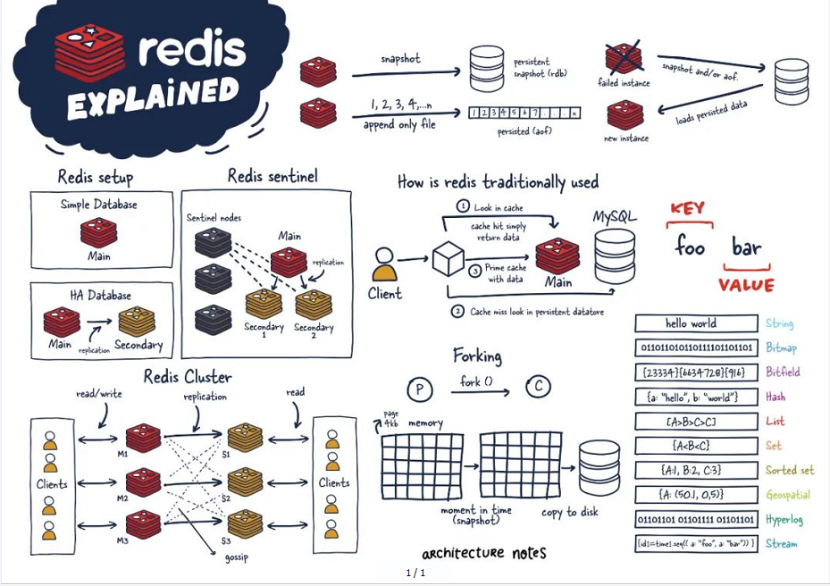

### Redis优势

> #### [Redis 与其他 key-value 存储有什么不同？](https://www.runoob.com/redis/redis-intro.html)
>
> Redis 与其他 key-value 存储系统的主要区别在于其提供了丰富的数据类型、高性能的读写能力、原子性操作、持久化机制、以及丰富的特性集。
>
> 以下是 Redis 的一些独特之处：
>
> - **丰富的数据类型：**Redis 不仅仅支持简单的 key-value 类型的数据，还提供了 list、set、zset（有序集合）、hash 等数据结构的存储。这些数据类型可以更好地满足特定的业务需求，使得 Redis 可以用于更广泛的应用场景。
> - **高性能的读写能力：**Redis 能读的速度是 110000次/s，写的速度是 81000次/s。这种高性能主要得益于 Redis 将数据存储在内存中，从而显著提高了数据的访问速度。
> - **原子性操作：**Redis 的所有操作都是原子性的，这意味着操作要么完全执行，要么完全不执行。这种特性对于确保数据的一致性和完整性非常重要。
> - **持久化机制：**Redis 支持数据的持久化，可以将内存中的数据保存在磁盘中，以便在系统重启后能够再次加载使用。这为 Redis 提供了数据安全性，确保数据不会因为系统故障而丢失。
> - **丰富的特性集：**Redis 还支持 publish/subscribe（发布/订阅）模式、通知、key 过期等高级特性。这些特性使得 Redis 可以用于消息队列、实时数据分析等复杂的应用场景。
> - **主从复制和高可用性：**Redis 支持 master-slave 模式的数据备份，提供了数据的备份和主从复制功能，增强了数据的可用性和容错性。
> - **支持 Lua 脚本：**Redis 支持使用 Lua 脚本来编写复杂的操作，这些脚本可以在服务器端执行，提供了更多的灵活性和强大的功能。
> - **单线程模型：**尽管 Redis 是单线程的，但它通过高效的事件驱动模型来处理并发请求，确保了高性能和低延迟。

#### **性能极高**

Redis能读的速度是110000次/秒，写的速度是81000次/秒

#### 数据类型丰富

Redis不仅仅支持简单的key-value类型的数据，同时还提供List、Let、Zset、Hash等数据结构的存储

#### 支持数据持久化

Redis可以将内存中的数据保持在磁盘中，重启的时候可以再次加载进行使用

#### 支持数据备份

Redis支持数据的备份，即`master-slave`模式的数据备份

### 小总结


## 去哪下

> 本课程采用 [7.0.0版本](https://github.com/redis/redis/releases/tag/7.0.0)

### 官网

Redis官网: https://redis.io/downloads/

Redis中文网: https://www.redis.net.cn/

Redis中文学习网: https://redis.com.cn/download.html

### 其他文档资料

Redis源码地址： https://github.com/redis/redis

Redis在线测试(貌似跑路了)

在线地址：https://try.redis.io

项目地址：https://github.com/alexmchale/try.redis

Redis命令参考：http://doc.redisfans.com

## 怎么玩

- 多数据类型基本操作配置
- 持久化和复制，RDB/AOF
- 事务控制
- 复制，集群
- ......

## Redis迭代演化和Redis7新特性

### Redis版本升级

Redis之父安特雷兹的发言: **http://antirez.com/news/132**

### 各版本抵达及推演过程

#### 里程碑的重要版本

5.0版本是直接升级到6.0版本，对于这个激进的升级，Redis之父antirez表现得很有信心和兴奋，所以第一时间发文来阐述6.0的一些重大功能"Redis 6.0.0 GA is out!"

随后Redis再接再厉，直接王炸Redis7.0  （2023年爆款）

2022年4月27日Redis正式发布了7.0更新（其实早在2022年1月31日，Redis已经预发布了7.0rc-1，经过社区的考验后，确认没重大Bug才会正式发布)

#### 各版本命名规则

Redis从发布至今，已经有十余年的时光了，一直遵循着自己的命名规则：

**版本号第二位如果是奇数，则为非稳定版本** 如2.7、2.9、3.1

**版本号第二位如果是偶数，则为稳定版本** 如2.6、2.8、3.0、3.2

**当前奇数版本就是下一个稳定版本的开发版本**，如2.9版本是3.0版本的开发版本

我们可以通过redis.io官网来下载自己感兴趣的版本进行源码阅读：

历史发布版本的源码：https://download.redis.io/releases/


### Redis7新特性

#### Redis7核心特性概览


2022 年 4 月正式发布的 Redis 7.0 是目前 Redis 历史版本中变化最大的版本。

首先，它有超过 50 个以上新增命令；其次，它有大量核心特性的新增和改进。


#### Redis Functions


#### Client-eviction


#### Muti-part AOF

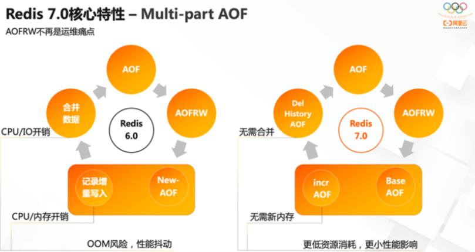

#### ACL V2


#### 新增命令

新增ZMPOP，BZMPOP，LMPOP，BLMPOP等新命令，对于EXPIRE和SET命令，新增了更多的命令参数选项。例如，ZMPOP的格式如下：ZMPOP numkeys key[key...] MIN\|MAX[COUNT count]，而BZMPOP是ZMPOP的阻塞版本。

#### listpack代替ziplist


listpack 是用来替代 ziplist 的新数据结构，在 7.0 版本已经没有 ziplist 的配置了（6.0版本仅部分数据类型作为过渡阶段在使用）

#### 底层性能提示


# Redis安装配置

## Windows安装

下载地址：https://github.com/dmajkic/redis/downloads

下载到的Redis支持32bit和64bit。根据自己实际情况选择，将64bit的内容cp到自定义盘符安装目录取名redis。 如 C:\reids

打开一个cmd窗口 使用cd命令切换目录到 C:\redis 运行 redis-server.exe redis.conf 。

如果想方便的话，可以把redis的路径加到系统的环境变量里，这样就省得再输路径了，后面的那个redis.conf可以省略，

如果省略，会启用默认的。输入之后，会显示如下界面：


这时候另启一个cmd窗口，原来的不要关闭，不然就无法访问服务端了。

切换到redis目录下运行 

```bash
redis-cli.exe -h 127.0.0.1 -p 6379 
```

设置键值对 

```bash
set myKey abc
```

取出键值

```bash
get myKey
```

## Linux安装

> 由于企业里面做Redis开发，99%都是Linux版的运用和安装，几乎不会涉及到Windows版，上一步的讲解只是为了知识的完整性，Windows版不作为重点，同学可以下去自己玩，企业实战就认一个版：Linux

### 准备gcc编译环境

#### 什么是gcc

gcc是linux下的一个编译程序，是C程序的编译工具。

GCC(GNU Compiler Collection) 是 GNU(GNU's Not Unix) 计划提供的编译器家族，它能够支持 C, C++, Objective-C, Fortran, Java 和 Ada 等等程序设计语言前端，同时能够运行在 x86, x86-64, IA-64, PowerPC, SPARC和Alpha 等等几乎目前所有的硬件平台上。鉴于这些特征，以及 GCC 编译代码的高效性，使得 GCC 成为绝大多数自由软件开发编译的首选工具。虽然对于程序员们来说，编译器只是一个工具，除了开发和维护人员，很少有人关注编译器的发展，但是 GCC 的影响力是如此之大，它的性能提升甚至有望改善所有的自由软件的运行效率，同时它的内部结构的变化也体现出现代编译器发展的新特征。

#### 安装gcc

```bash
yum -y install gcc-c++
```


#### 查看gcc版本

```bash
gcc -v
```


### Redis安装步骤

> 官方建议升级到6.0.8以上版本

#### 1、**下载获得安装包**

下载`redis-7.0.0.tar.gz`后将它放入`/opt` 目录下

可以在本地下载好上传到虚拟机，也可直接使用命令下载

```bash
wget https://download.redis.io/releases/redis-7.0.0.tar.gz
```


查看压缩包信息

```bash
ls -l redis-7.0.0.tar.gz
```


#### 2、**解压文件**

```bash
tar -zxvf redis-7.0.0.tar.gz
```

切换到解压后的目录内

```bash
cd redis-7.0.0
```

#### **3、执行make命令**

```bash
make && make install
```


出现如下界面代表执行无错误


查看已安装文件

> Linux下的/usr/local类似windows系统的C:\\\\Proaram files


<font color = 'red'>redis-cli：Redis客户端，操作入口</font>

<font color = 'red'>redis-sentinel：redis集群使用</font>

`redis-benchmark`： 性能测试工具，服务启动后运行该命令，可查看系统性能

`redis-check-aof`：修复有问题的AOF文件

`redis-check-dump`：修复有问题的`dump.rdb`文件

`redis-server`：Redis服务器启动命令

#### **4、将默认的`redis.con`拷贝到自定义目录**


#### <font color='red'>5、修改备份目录下redis.conf配置文件做初始化设置</font>

> `redis.conf`配置文件，改完后确保生效，记得重启，记得重启

1、默认`daemonize no` 改为 `daemonize yes`


2、默认`protected-mode yes`  改为 `protected-mode no`


3、默认`bind 127.0.0.1`直接注释掉(127.0.0.1只能本机访问)或改成本机IP地址，否则影响远程IP连接


4、添加redis密码 `requirepass <你的密码>`


#### 6、启动服务

##### redis-cli连接和“乒乓球”

`usr/local/bin`目录下运行`redis-server`启用备份文件目录下的`redis.conf`文件


##### **解决警告问题**

> Warning: Using a password with '-a' or '-u' option on the command line interface may not be safe.

warning 这串输出并不是普通输出

shell的标准输出包含两种：

1：（标准输出）

2：（标准错误）我们的命令，即包含1也包含2，2即是我们想要去除的提示。

解决办法将标准错误去除即可，追加`2>/dev/nul`，将标准错误丢弃即可，就没有烦人的警告了。

```bash
redis-cli -a shiguang -p 6379 2>/dev/nul
```


#### 7、6379端口的由来

Redis的默认端口是`6379`，是由手机键盘字母`MERZ`的位置决定的。MERZ在Antirez的朋友圈语言中是"愚蠢和傻B"的代名词，它源于意大利广告女郎`Alessia Merz`在电视节目上说了一堆愚蠢的话，redis之父对她有"特殊"印象，就给她弄成端口号了

#### 8、helloworld小练习

设置一个key为key，值为 “helloworld”

```bash
set key helloworld
```

获取 key

```
get key
```


#### 9、关闭实例

单实例关闭

```bash
redis-cli -a <your-password> shutdown
```

多实例关闭（指定端口）

```bash
redis-cli -p 6379 shutdown
```


## Docker安装

> https://www.bilibili.com/video/BV1gr4y1U7CY/?p=39

## Redis卸载

### 停止redis-server服务


### 删除 `/usr/local/lib` 目录下与redis相关的文件


# Redis十大数据类型

> 这里说的数据类型是valuel的数据类型，key的类型都是字符串

Redis 主要支持以下几种数据类型：

- **string（字符串）:** 基本的数据存储单元，可以存储字符串、整数或者浮点数。
- **hash（哈希）:**一个键值对集合，可以存储多个字段。
- **list（列表）:**一个简单的列表，可以存储一系列的字符串元素。
- **set（集合）:**一个无序集合，可以存储不重复的字符串元素。
- **zset(sorted set：有序集合):** 类似于集合，但是每个元素都有一个分数（score）与之关联。
- **位图（Bitmaps）：**基于字符串类型，可以对每个位进行操作。
- **超日志（HyperLogLogs）：**用于基数统计，可以估算集合中的唯一元素数量。
- **地理空间（Geospatial）：**用于存储地理位置信息。
- **发布/订阅（Pub/Sub）：**一种消息通信模式，允许客户端订阅消息通道，并接收发布到该通道的消息。
- **流（Streams）：**用于消息队列和日志存储，支持消息的持久化和时间排序。
- **模块（Modules）：**Redis 支持动态加载模块，可以扩展 Redis 的功能。


## String（字符串）

string 是 redis 最基本的类型，你可以理解成与 Memcached 一模一样的类型，一个 key 对应一个 value。

String类型是<font color = 'red'>二进制安全的</font>。意思是 redis 的 string 可以包含任何数据，比如jpg图片或者序列化的对象。

string 类型是 Redis 最基本的数据类型，string 类型的值最大能存储 512MB。

## List（列表）

Redis列表是简单的字符串列表，按照插入顺序排序。

你可以添加一个元素到列表的<font color = 'blue'>头部（左边）或者尾部（右边）</font>

它的底层实际是个<font color='red'>双端链表</font>，最多可以包含 `2^32 - 1` 个元素 (4294967295, 每个列表超过40亿个元素)

## **hash（哈希）**

Redis hash 是一个键值(key=>value)对集合，类似于一个小型的 NoSQL 数据库。

Redis hash 是一个 string 类型的 field 和 value 的映射表，hash 特别适合用于存储对象。

每个哈希最多可以存储 `2^32 - 1` 个键值对。

## Set（集合）

Redis 的 Set 是 String 类型的无序集合。

集合成员是唯一的，这就意味着集合中不能出现重复的数据，集合对象的编码可以是 `intset` 或者 `hashtable`。

Redis 中Set集合是通过哈希表实现的，所以添加，删除，查找的复杂度都是 `O(1)`。

集合中最大的成员数为 `2^32 - 1` (4294967295, 每个集合可存储40多亿个成员)

## zset（sorted set：有序集合）

Redis zset 和 set 一样也是string类型元素的集合,且不允许重复的成员。

<font color='red'>不同的是每个元素都会关联一个double类型的分数</font>，redis正是通过分数来为集合中的成员进行从小到大的排序。

<font color='red'>zset的成员是唯一的,但分数(score)却可以重复</font>。

<font color='red'>zset集合是通过哈希表实现的，所以添加，删除，查找的复杂度都是 O(1)。 集合中最大的成员数为 2^32 - 1</font>

## GEO（地理空间）

Redis GEO 主要用于存储地理位置信息，并对存储的信息进行操作，包括：

1. 添加地理位置的坐标。
2. 获取地理位置的坐标。
3. 计算两个位置之间的距离。
4. 根据用户给定的经纬度坐标来获取指定范围内的地理位置集合

## HyperLogLog（基数统计）

HyperLogLog 是用来做<font color='red'>基数统计</font>的算法，HyperLogLog 的优点是，在输入元素的数量或者体积非常非常大时，计算基数所需的空间总是固定且是很小的。

在 Redis 里面，每个 HyperLogLog 键只需要花费 12 KB 内存，就可以计算接近 2^64 个不同元素的基 数。这和计算基数时，元素越多耗费内存就越多的集合形成鲜明对比。

但是，因为 HyperLogLog 只会根据输入元素来计算基数，而不会储存输入元素本身，所以 HyperLogLog 不能像集合那样，返回输入的各个元素。

常用于统计唯一值的近似值

## Bitmap（位图）


由0和1状态表现的二进制位的位（bit）数组，可以对字符串进行位操作。

常用于实现布隆过滤器等位操作。

## Bitfield（位域）

通过bitfield命令可以一次性操作多个<font color='red'>比特位域(指的是连续的多个比特位)</font>，它会执行一系列操作并返回一个响应数组，这个数组中的元素对应参数列表中的相应操作的执行结果。

说白了就是通过bitfield命令我们可以一次性对多个比特位域进行操作。

## Stream（流）

Redis Stream 是 Redis 5.0 版本新增加的数据结构。

Redis Stream 主要用于消息队列（MQ，Message Queue），Redis 本身是有一个 Redis 发布订阅 (pub/sub) 来实现消息队列的功能，但它有个缺点就是消息无法持久化，如果出现网络断开、Redis 宕机等，消息就会被丢弃。

简单来说发布订阅 (pub/sub) 可以分发消息，但无法记录历史消息。

而 Redis Stream 提供了消息的持久化和主备复制功能，可以让任何客户端访问任何时刻的数据，并且能记住每一个客户端的访问位置，还能保证消息不丢失

日志数据类型，支持时间序列数据。

用于消息队列和实时数据处理。


# Redis常用命令

## 如何查找命令

> 命令不区分大小写，而key是区分大小写的

官网：https://redis.io/commands

Redis中文学习网：https://redis.com.cn/commands.html

使用`help @<类型>`  获取指定类型下的所有命令，如 `help @string`

## Redis keys 命令

下表给出了与 Redis 键相关的基本命令：

| 序号 | 命令及描述                                                   |
| :--- | :----------------------------------------------------------- |
| 1    | [DEL key](https://www.runoob.com/redis/keys-del.html) 该命令用于在 key 存在时删除 key。 |
| 2    | [DUMP key](https://www.runoob.com/redis/keys-dump.html) 序列化给定 key ，并返回被序列化的值。 |
| 3    | [EXISTS key](https://www.runoob.com/redis/keys-exists.html) 检查给定 key 是否存在。 |
| 4    | [EXPIRE key](https://www.runoob.com/redis/keys-expire.html) seconds 为给定 key 设置过期时间，以秒计。 |
| 5    | [EXPIREAT key timestamp](https://www.runoob.com/redis/keys-expireat.html) EXPIREAT 的作用和 EXPIRE 类似，都用于为 key 设置过期时间。 不同在于 EXPIREAT 命令接受的时间参数是 UNIX 时间戳(unix timestamp)。 |
| 6    | [PEXPIRE key milliseconds](https://www.runoob.com/redis/keys-pexpire.html) 设置 key 的过期时间以毫秒计。 |
| 7    | [PEXPIREAT key milliseconds-timestamp](https://www.runoob.com/redis/keys-pexpireat.html) 设置 key 过期时间的时间戳(unix timestamp) 以毫秒计 |
| 8    | [KEYS pattern](https://www.runoob.com/redis/keys-keys.html) 查找所有符合给定模式( pattern)的 key 。 |
| 9    | [MOVE key db](https://www.runoob.com/redis/keys-move.html) 将当前数据库的 key 移动到给定的数据库 db 当中。 |
| 10   | [PERSIST key](https://www.runoob.com/redis/keys-persist.html) 移除 key 的过期时间，key 将持久保持。 |
| 11   | [PTTL key](https://www.runoob.com/redis/keys-pttl.html) 以毫秒为单位返回 key 的剩余的过期时间。 |
| 12   | [TTL key](https://www.runoob.com/redis/keys-ttl.html) 以秒为单位，返回给定 key 的剩余生存时间(TTL, time to live)。 |
| 13   | [RANDOMKEY](https://www.runoob.com/redis/keys-randomkey.html) 从当前数据库中随机返回一个 key 。 |
| 14   | [RENAME key newkey](https://www.runoob.com/redis/keys-rename.html) 修改 key 的名称 |
| 15   | [RENAMENX key newkey](https://www.runoob.com/redis/keys-renamenx.html) 仅当 newkey 不存在时，将 key 改名为 newkey 。 |
| 16   | [SCAN cursor [MATCH pattern\] [COUNT count]](https://www.runoob.com/redis/keys-scan.html) 迭代数据库中的数据库键。 |
| 17   | [TYPE key](https://www.runoob.com/redis/keys-type.html) 返回 key 所储存的值的类型。 |


`keys *`: 查看当前库所有的key

`exists key`: 判断某个key是否存在，可以一次性输入多个key，返回实际存在的key的数量

`type key`: 查看key的类型

`del key` : 删除key,可以一次性输入多个key，返回删除成功的key的数量

`unlink key`：非阻塞删除，仅仅将keys从keyspace元数据中删除，真正的删除会在后续异步中操作。

`ttl key`：查看还有多少秒过期，`-1`表示永不过期，`-2`表示已过期

`expire key 秒钟`: 为给定的key设置过期时间

`move key dbindex`: 将当前数据库的key移动到给定的数据库当中，一个Redis默认有16个数据库，dbindex范围 [0-15]，默认使用下标为0的库

`select dbindex`: 切换数据库，默认为0

`dbsize`：查看当前数据库key的数量

`flushdb`: 清空当前库

`flushall`: 清空所有库


## 各数据类型命令

### String（字符串）

> 单key单value

#### 基本命令

##### 设置key

```bash
set key value [NX|XX] [GET] [EX seconds|PX milliseconds|EXAT unix-time-seconds|PXAT unix-time-milliseconds|KEEPTTL]
```

`SET`命令有`EX`、`PX`、`NX`、`XX`以及`KEEPTTL`五个可选参数，其中`KEEPTTL`为6.O版本添加的可选参数，其它为2.6.12版本添加的可选参数。

- `EX seconds`：以秒为单位设置过期时间
- `PX milliseconds`：以毫秒为单位设置过期时间
- `EXAT timestamp`: 设置以秒为单位的UNIX时间戳所对应的时间为过期时间
- `PXAT milliseconds-timestamp`：设置以毫秒为单位的UNIX时间戳所对应的时间为过期时间
- `NX`：键不存在的时候设置键值
- `XX`：键存在的时候设置键值
- `KEEPTTL`: 保留设置前指定键的生存时间
- `GET`： 返回指定键原本的值，若键不存在时返回`nil`

`SET`命令使用`EX`、`PX`、`NX`参数，其效果等同于`SETEX`、`PSETEX`、`SETNX`命令。根据官方文档的描述，未来版本中`SETEX`、`PSETEX`、`SETNX`命令可能会被淘汰。
`EXAT`、`PXAT`以及`GET`为Redis 6.2新增的可选参数。

使用`GET`参数时，也可与`SET`连用为`GETSET` ，如`getset key1 val1`

**返回值**
设置成功则返回`OK`，失败返回`nil`，如不满足`NX`、`XX`条件等。
若使用`GET`参数，则返回该键原来的值，键不存在时返回`nil`。


**如何获得设置指定key过期的Unix时间，单位为秒**

```java
public static void main(String[] args) {
    // 获取设置指定key过期的Unix时间，单位为秒
    System.out.println(System.currentTimeMillis()/1000L);
}
```


##### 获取key

[GET key](https://www.runoob.com/redis/strings-get.html):获取指定 key 的值。


#### 同时设置/获取多个键值

`MSET key value [key value...]`: 同时设置一个或多个 key-value 对

`MGET key [key...]`: 同时获取一个或多个给定 key 的值

`MSETNX key value [key value..]`: 同时设置一个或多个 key-value 对，当且仅当所有给定 key 都不存在


#### 获取指定区间范围内的值

`GETRANGE key`: 获取指定区间范围内的值，类似between......and的关系,从零到负一表示全部


`SETRANGE key offset value`: 设置指定区间范围内的值，将指定偏移数后面与value长度相等的内容覆盖


#### 数值增减

> 只有数值类型才能进行增减

`INCR key`： 数值递增

`INCRBY key increment `  :  给数值增加指定的整数

`DECR key`: 数值递减

`DECRBY key decrement`: 给数值减小指定的整数


**应用场景**：

1. 点赞量
2. 浏览量
3. 喜欢量
4. ......


#### 获取字符串长度以及内容追加

`STRLEN key`： 获取key的长度

`APPEND key value` : 为key在末尾追加指定字符


#### 分布式锁

`SETNX key value`: set if not exist，key不存在时设置key

`SETEX key value`: set with expire ，key超时时设置key

在需要分布式锁的场景中采用以上两种方式设置key，这个key就可以看做一个锁，未被占用时才能设置成功


### List（列表）

> 单key多value

<font color = 'red'>一个双端链表的结构</font>，容量是`2^32 - 1` 个元素，大概40多亿，主要功能有`push`/`pop`等，一般用在栈、队列、消息队列等场景。

left、right都可以插入添加；

如果键不存在，创建新的链表；

如果键已存在，新增内容；

如果值全移除，对应的键也就消失了。

<font color = 'blue'>它的底层实际是个**双向链表，对两端的操作性能很高，通过索引下标的操作中间的节点性能会较差。**</font>


下表列出了列表相关的基本命令：

| 序号 | 命令及描述                                                   |
| :--- | :----------------------------------------------------------- |
| 1    | [BLPOP key1 [key2 \] timeout](https://www.runoob.com/redis/lists-blpop.html) 移出并获取列表的第一个元素， 如果列表没有元素会阻塞列表直到等待超时或发现可弹出元素为止。 |
| 2    | [BRPOP key1 [key2 \] timeout](https://www.runoob.com/redis/lists-brpop.html) 移出并获取列表的最后一个元素， 如果列表没有元素会阻塞列表直到等待超时或发现可弹出元素为止。 |
| 3    | [BRPOPLPUSH source destination timeout](https://www.runoob.com/redis/lists-brpoplpush.html) 从列表中弹出一个值，将弹出的元素插入到另外一个列表中并返回它； 如果列表没有元素会阻塞列表直到等待超时或发现可弹出元素为止。 |
| 4    | [LINDEX key index](https://www.runoob.com/redis/lists-lindex.html) 通过索引获取列表中的元素 |
| 5    | [LINSERT key BEFORE\|AFTER pivot value](https://www.runoob.com/redis/lists-linsert.html) 在列表的元素前或者后插入元素 |
| 6    | [LLEN key](https://www.runoob.com/redis/lists-llen.html) 获取列表长度 |
| 7    | [LPOP key](https://www.runoob.com/redis/lists-lpop.html) 移出并获取列表的第一个元素 |
| 8    | [LPUSH key value1 [value2\]](https://www.runoob.com/redis/lists-lpush.html) 将一个或多个值插入到列表头部 |
| 9    | [LPUSHX key value](https://www.runoob.com/redis/lists-lpushx.html) 将一个值插入到已存在的列表头部 |
| 10   | [LRANGE key start stop](https://www.runoob.com/redis/lists-lrange.html) 获取列表指定范围内的元素 |
| 11   | [LREM key count value](https://www.runoob.com/redis/lists-lrem.html) 移除列表元素 |
| 12   | [LSET key index value](https://www.runoob.com/redis/lists-lset.html) 通过索引设置列表元素的值 |
| 13   | [LTRIM key start stop](https://www.runoob.com/redis/lists-ltrim.html) 对一个列表进行修剪(trim)，就是说，让列表只保留指定区间内的元素，不在指定区间之内的元素都将被删除。 |
| 14   | [RPOP key](https://www.runoob.com/redis/lists-rpop.html) 移除列表的最后一个元素，返回值为移除的元素。 |
| 15   | [RPOPLPUSH source destination](https://www.runoob.com/redis/lists-rpoplpush.html) 移除列表的最后一个元素，并将该元素添加到另一个列表并返回 |
| 16   | [RPUSH key value1 [value2\]](https://www.runoob.com/redis/lists-rpush.html) 在列表中添加一个或多个值到列表尾部 |
| 17   | [RPUSHX key value](https://www.runoob.com/redis/lists-rpushx.html) 为已存在的列表添加值 |

`	LPUSH key value1 [value2]`: 将一个或多个值插入到列表头部

`RPUSH key value1 [value2]`: 在列表中添加一个或多个值到列表尾部

`LRANGE key start stop `: 获取列表指定范围内的元素


`LPOP key`: 移出并获取列表的第一个元素

`RPOP key`: 移除列表的最后一个元素，返回值为移除的元素。


`LINDEX key index `: 通过索引获取列表中的元素


`LLEN key `: 获取列表长度

`LREM key count value `: 移除列表元素


`LTRIM key start stop`: 对一个列表进行修剪(trim)，就是说，让列表只保留指定区间内的元素，不在指定区间之内的元素都将被删除。


`RPOPLPUSH source destination`: 移除列表的最后一个元素，并将该元素添加到另一个列表并返回


`LSET key index value `: 通过索引设置列表元素的值

`LINSERT key BEFORE|AFTER pivot value ` : 在列表的元素前或者后插入元素


### **hash（哈希）**

> KV模式不变，但V是一个键值对，相当于 Map<String，Map<Object,Object>>

下表列出了 redis hash 基本的相关命令：

| 序号 | 命令及描述                                                   |
| :--- | :----------------------------------------------------------- |
| 1    | [HDEL key field1 [field2\]](https://www.runoob.com/redis/hashes-hdel.html) 删除一个或多个哈希表字段 |
| 2    | [HEXISTS key field](https://www.runoob.com/redis/hashes-hexists.html) 查看哈希表 key 中，指定的字段是否存在。 |
| 3    | [HGET key field](https://www.runoob.com/redis/hashes-hget.html) 获取存储在哈希表中指定字段的值。 |
| 4    | [HGETALL key](https://www.runoob.com/redis/hashes-hgetall.html) 获取在哈希表中指定 key 的所有字段和值 |
| 5    | [HINCRBY key field increment](https://www.runoob.com/redis/hashes-hincrby.html) 为哈希表 key 中的指定字段的整数值加上增量 increment 。 |
| 6    | [HINCRBYFLOAT key field increment](https://www.runoob.com/redis/hashes-hincrbyfloat.html) 为哈希表 key 中的指定字段的浮点数值加上增量 increment 。 |
| 7    | [HKEYS key](https://www.runoob.com/redis/hashes-hkeys.html) 获取哈希表中的所有字段 |
| 8    | [HLEN key](https://www.runoob.com/redis/hashes-hlen.html) 获取哈希表中字段的数量 |
| 9    | [HMGET key field1 [field2\]](https://www.runoob.com/redis/hashes-hmget.html) 获取所有给定字段的值 |
| 10   | [HMSET key field1 value1 [field2 value2 \]](https://www.runoob.com/redis/hashes-hmset.html) 同时将多个 field-value (域-值)对设置到哈希表 key 中。 |
| 11   | [HSET key field value](https://www.runoob.com/redis/hashes-hset.html) 将哈希表 key 中的字段 field 的值设为 value 。 |
| 12   | [HSETNX key field value](https://www.runoob.com/redis/hashes-hsetnx.html) 只有在字段 field 不存在时，设置哈希表字段的值。 |
| 13   | [HVALS key](https://www.runoob.com/redis/hashes-hvals.html) 获取哈希表中所有值。 |
| 14   | [HSCAN key cursor [MATCH pattern\] [COUNT count]](https://www.runoob.com/redis/hashes-hscan.html) 迭代哈希表中的键值对。 |


`HSET key field value`:  将哈希表 key 中的字段 field 的值设为 value 。也支持将多个 field-value (域-值)对设置到哈希表 key 中，与 `HMSET`命令相同

`HGET key field `: 获取存储在哈希表中指定字段的值。

`HMSET key field1 value1 [field2 value2 ]`：同时将多个 field-value (域-值)对设置到哈希表 key 中。

`HMGET key field1 [field2]`: 获取所有给定字段的值


`HGETALL key `: 获取在哈希表中指定 key 的所有字段和值

`HDEL key field1 [field2]`: 删除一个或多个哈希表字段

`HLEN key`: 获取哈希表中字段的数量

`HEXISTS key field `: 查看哈希表 key 中，指定的字段是否存在。

`HKEYS key`:  获取哈希表中的所有字段

`HVALS key`: 获取哈希表中所有值。

`HINCRBY key field increment` : 为哈希表 key 中的指定字段的整数值加上增量 increment 。

`HINCRBYFLOAT key field increment`: 为哈希表 key 中的指定字段的浮点数值加上增量 increment 。

`HSETNX key field value`: 只有在字段 field 不存在时，设置哈希表字段的值。


**应用场景：**

京东购物车早期，涉及目前不再采用，当前小中厂可用

新增商品 → hset shopcar:uid1024 334488 1

新增商品 → hset shopcar:uid1024 334477 1

增加商品数量 → hincrby shopcar:uid1024 334477 1

商品总数 → hlen shopcar:uid1024

全部选择 → hgetall shopcar:uid1024


### Set（集合）

> 单值多Value，无序无重复

下表列出了 Redis 集合基本命令：

| 序号 | 命令及描述                                                   |
| :--- | :----------------------------------------------------------- |
| 1    | [SADD key member1 [member2\]](https://www.runoob.com/redis/sets-sadd.html) 向集合添加一个或多个成员 |
| 2    | [SCARD key](https://www.runoob.com/redis/sets-scard.html) 获取集合的成员数 |
| 3    | [SDIFF key1 [key2\]](https://www.runoob.com/redis/sets-sdiff.html) 返回第一个集合与其他集合之间的差异。 |
| 4    | [SDIFFSTORE destination key1 [key2\]](https://www.runoob.com/redis/sets-sdiffstore.html) 返回给定所有集合的差集并存储在 destination 中 |
| 5    | [SINTER key1 [key2\]](https://www.runoob.com/redis/sets-sinter.html) 返回给定所有集合的交集 |
| 6    | [SINTERSTORE destination key1 [key2\]](https://www.runoob.com/redis/sets-sinterstore.html) 返回给定所有集合的交集并存储在 destination 中 |
| 7    | [SISMEMBER key member](https://www.runoob.com/redis/sets-sismember.html) 判断 member 元素是否是集合 key 的成员 |
| 8    | [SMEMBERS key](https://www.runoob.com/redis/sets-smembers.html) 返回集合中的所有成员 |
| 9    | [SMOVE source destination member](https://www.runoob.com/redis/sets-smove.html) 将 member 元素从 source 集合移动到 destination 集合 |
| 10   | [SPOP key](https://www.runoob.com/redis/sets-spop.html) 移除并返回集合中的一个随机元素 |
| 11   | [SRANDMEMBER key [count\]](https://www.runoob.com/redis/sets-srandmember.html) 返回集合中一个或多个随机数 |
| 12   | [SREM key member1 [member2\]](https://www.runoob.com/redis/sets-srem.html) 移除集合中一个或多个成员 |
| 13   | [SUNION key1 [key2\]](https://www.runoob.com/redis/sets-sunion.html) 返回所有给定集合的并集 |
| 14   | [SUNIONSTORE destination key1 [key2\]](https://www.runoob.com/redis/sets-sunionstore.html) 所有给定集合的并集存储在 destination 集合中 |
| 15   | [SSCAN key cursor [MATCH pattern\] [COUNT count]](https://www.runoob.com/redis/sets-sscan.html) 迭代集合中的元素 |

#### 常用命令

`SADD key member1 [member2]`: 向集合添加一个或多个成员

`SMEMBERS key`: 返回集合中的所有成员

`SISMEMBER key member`: 判断 member 元素是否是集合 key 的成员

`SREM key member1 [member2]`: 移除集合中一个或多个成员


`SCARD key`: 获取集合的成员数

`SRANDMEMBER key [count]`: 返回集合中一个或多个随机元素

`SPOP key [count]`: 移除并返回集合中的一个或多个随机元素

`SMOVE source destination member`: 将 member 元素从 source 集合移动到 destination 集合


#### 集合运算

`SDIFF key1 [key2]`: 返回第一个集合与其他集合之间的差异。A-B [-C...]

`SUNION key1 [key2]`: 返回所有给定集合的并集

`SINTER key1 [key2]`： 返回给定所有集合的交集


`SINTERCARD numkeys key [key...] [LIMIT limit]`:

Redis7的新命令，返回由所有给定集合的交集产生的基数（去重统计数）


#### 应用场景

1、抽奖小程序

2、朋友圈点赞


3、可能认识的人


### zset（sorted set：有序集合）

下表列出了 redis 有序集合的基本命令:

| 序号 | 命令及描述                                                   |
| :--- | :----------------------------------------------------------- |
| 1    | [ZADD key score1 member1 [score2 member2\]](https://www.runoob.com/redis/sorted-sets-zadd.html) 向有序集合添加一个或多个成员，或者更新已存在成员的分数 |
| 2    | [ZCARD key](https://www.runoob.com/redis/sorted-sets-zcard.html) 获取有序集合的成员数 |
| 3    | [ZCOUNT key min max](https://www.runoob.com/redis/sorted-sets-zcount.html) 计算在有序集合中指定区间分数的成员数 |
| 4    | [ZINCRBY key increment member](https://www.runoob.com/redis/sorted-sets-zincrby.html) 有序集合中对指定成员的分数加上增量 increment |
| 5    | [ZINTERSTORE destination numkeys key [key ...\]](https://www.runoob.com/redis/sorted-sets-zinterstore.html) 计算给定的一个或多个有序集的交集并将结果集存储在新的有序集合 destination 中 |
| 6    | [ZLEXCOUNT key min max](https://www.runoob.com/redis/sorted-sets-zlexcount.html) 在有序集合中计算指定字典区间内成员数量 |
| 7    | [ZRANGE key start stop [WITHSCORES\]](https://www.runoob.com/redis/sorted-sets-zrange.html) 通过索引区间返回有序集合指定区间内的成员 |
| 8    | [ZRANGEBYLEX key min max [LIMIT offset count\]](https://www.runoob.com/redis/sorted-sets-zrangebylex.html) 通过字典区间返回有序集合的成员 |
| 9    | [ZRANGEBYSCORE key min max [WITHSCORES\] [LIMIT]](https://www.runoob.com/redis/sorted-sets-zrangebyscore.html) 通过分数返回有序集合指定区间内的成员 |
| 10   | [ZRANK key member](https://www.runoob.com/redis/sorted-sets-zrank.html) 返回有序集合中指定成员的索引 |
| 11   | [ZREM key member [member ...\]](https://www.runoob.com/redis/sorted-sets-zrem.html) 移除有序集合中的一个或多个成员 |
| 12   | [ZREMRANGEBYLEX key min max](https://www.runoob.com/redis/sorted-sets-zremrangebylex.html) 移除有序集合中给定的字典区间的所有成员 |
| 13   | [ZREMRANGEBYRANK key start stop](https://www.runoob.com/redis/sorted-sets-zremrangebyrank.html) 移除有序集合中给定的排名区间的所有成员 |
| 14   | [ZREMRANGEBYSCORE key min max](https://www.runoob.com/redis/sorted-sets-zremrangebyscore.html) 移除有序集合中给定的分数区间的所有成员 |
| 15   | [ZREVRANGE key start stop [WITHSCORES\]](https://www.runoob.com/redis/sorted-sets-zrevrange.html) 返回有序集中指定区间内的成员，通过索引，分数从高到低 |
| 16   | [ZREVRANGEBYSCORE key max min [WITHSCORES\]](https://www.runoob.com/redis/sorted-sets-zrevrangebyscore.html) 返回有序集中指定分数区间内的成员，分数从高到低排序 |
| 17   | [ZREVRANK key member](https://www.runoob.com/redis/sorted-sets-zrevrank.html) 返回有序集合中指定成员的排名，有序集成员按分数值递减(从大到小)排序 |
| 18   | [ZSCORE key member](https://www.runoob.com/redis/sorted-sets-zscore.html) 返回有序集中，成员的分数值 |
| 19   | [ZUNIONSTORE destination numkeys key [key ...\]](https://www.runoob.com/redis/sorted-sets-zunionstore.html) 计算给定的一个或多个有序集的并集，并存储在新的 key 中 |
| 20   | [ZSCAN key cursor [MATCH pattern\] [COUNT count]](https://www.runoob.com/redis/sorted-sets-zscan.html) 迭代有序集合中的元素（包括元素成员和元素分值） |


#### 常用命令

`ZADD key score1 member1 [score2 member2]`:

向有序集合添加一个或多个成员，或者更新已存在成员的分数

`ZRANGE key start stop [WITHSCORES]`: 通过索引区间按照顺序返回有序集合指定区间内的成员，使用`WITHSCORES`参数时会返回score值


`ZREVRANGE key start stop [WITHSCORES]`: 返回有序集中指定区间内的成员，通过索引，分数从高到低

`ZRANGEBYSCORE key min max [WITHSCORES] [LIMIT offset count]`: 

通过分数返回有序集合指定区间内的成员，`(` 代表不包含


`ZREVRANGE key start stop [WITHSCORES]`: 返回有序集中指定区间内的成员，通过索引，分数从高到低

`ZREVRANGEBYSCORE key max min [WITHSCORES]`: 返回有序集中指定分数区间内的成员，分数从高到低排序

`ZSCORE key member`: 返回有序集中，成员的分数值

`ZCARD key`: 获取有序集合的成员数

`ZREM key member [member ...]`: 移除有序集合中的一个或多个成员

`ZINCRBY key increment member`: 有序集合中对指定成员的分数加上增量 increment

`ZCOUNT key min max`: 计算在有序集合中指定区间分数的成员数

`ZMPOP numkeys key [key ...] MIN|MAX [COUNT count]`:

Resid7新命令，从键名列表中的第一个非空排序集中弹出一个或多个元素，它们是成员分数对


`ZRANK key member`: 返回有序集合中指定成员的索引

`ZREVRANK key member`: 返回有序集合中指定成员的排名，有序集成员按分数值递减(从大到小)排序


#### 应用场景

根据商品销售对商品进行排序显示


### Bitmap（位图）

> 由0和1状态表现的二进制bit数组，常用于状态记录及统计


#### 基本命令

`SETBIT key offset value`: 给指定的值的第offset赋值，值只能是0或1，时间复杂度`O(1)`

`GETBIT key offset`： 获取指定key的第offset位置的值，偏移量从0开始，时间复杂度`O(1)`


`STRLEN key`: 统计占用多少字节数，超过8位后按照8位一组一byte进行扩容


`BITCOUNT key  [start end [BYTE|BIT]]`: 返回指定key中[start end]中为1的数量，时间复杂度`O(n)`

`BITOP operation destkey key`: 

对不同的二进制存储数据进行位运算(ADN、OR、NOT、XOR)，将运算后的结果存储到一个新的集合中，参数`destkey `用于指定新集合的key，时间复杂度`O(n)`


#### 应用场景

统计全年（按365天）记录需占用字节数


### HyperLogLog（基数统计）


#### 基数统计介绍

基数统计用于统计一个集合中不重复的元素个数


#### 需求场景

> UA（Unique Visitor）独立访客，一般理解为客户IP，统计时需去重

- 统计某网站UA、统计某个文章UA
- 用户搜索网站关键词数量
- 统计用户每天搜索不同字条个数
- ......

#### 基本命令

下表列出了 redis HyperLogLog 的基本命令：

| 序号 | 命令及描述                                                   |
| :--- | :----------------------------------------------------------- |
| 1    | [PFADD key element [element ...\]](https://www.runoob.com/redis/hyperloglog-pfadd.html) 添加指定元素到 HyperLogLog 中。 |
| 2    | [PFCOUNT key [key ...\]](https://www.runoob.com/redis/hyperloglog-pfcount.html) 返回给定 HyperLogLog 的基数估算值。 |
| 3    | [PFMERGE destkey sourcekey [sourcekey ...\]](https://www.runoob.com/redis/hyperloglog-pfmerge.html) 将多个 HyperLogLog 合并为一个 HyperLogLog |

### GEO（地理空间）

> Redis在3.2版本以后增加了地图位置的处理功能

#### 相关介绍

地球上的地理位置是使用二维的经纬度表示，经度范围 (-180, 180]，纬度范围 (-90, 90]，只要我们确定一个点的经纬度就可以名取得他在地球的位置。

例如滴滴打车，最直观的操作就是实时记录更新各个车的位置，然后当我们要找车时，在数据库中查找距离我们(坐标x0,y0)附近r公里范围内部的车辆

使用如下SQL即可：

```bash
select taxi from position where x0-r < x < x0 + r and y0-r < y < y0+r
```

**存在的问题**

1.查询性能问题，如果并发高，数据量大这种查询是要搞垮数据库的

2.这个查询的是一个矩形访问，而不是以我为中心r公里为半径的圆形访问。

3.精准度的问题，我们知道地球不是平面坐标系，而是一个圆球，这种矩形计算在长距离计算时会有很大误差

#### 原理

核心思想就是将球体转换为平面，区块转换为一点

主要分为三步：

1. 将三维的地球变为二维的坐标
2. 再将二维的坐标转换为一维的点块
3. 最后将一维的点块转换为二进制再通过base32编码


#### 常用命令

`GEOADD key [NX|XX] [CH] longitude latitude member [longitude latitude member ...]`:

将多个精度（longitude）、维度（latitude）、位置名称（member）添加到指定的key中

```bash
GEOADD city 116.403963 39.915119 "天安门" 116.403414 39.924091 "故宫" 116.024067 40.362639 "长城"
```

GEO是ZSET的子集，可以使用ZSET相关命令

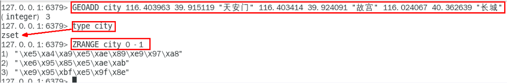

**解决乱码问题**


`GEOPOS key member [member ...]`： 从键里返回所有给定位置元素的位置（精度和维度）


`GEODIST key member1 member2 [M|KM|FT|MI]`: 返回两个给定位置之间的距离

- m ：米，默认单位。
- km ：千米。
- mi ：英里。
- ft ：英尺。


#### **georadius、georadiusbymember**

georadius 以给定的经纬度为中心， 返回键包含的位置元素当中， 与中心的距离不超过给定最大距离的所有位置元素。

georadiusbymember 和 GEORADIUS 命令一样， 都可以找出位于指定范围内的元素， 但是 georadiusbymember 的中心点是由给定的位置元素决定的， 而不是使用经度和纬度来决定中心点。

georadius 与 georadiusbymember 语法格式如下：

```bash
GEORADIUS key longitude latitude radius m|km|ft|mi [WITHCOORD] [WITHDIST] [WITHHASH] [COUNT count] [ASC|DESC] [STORE key] [STOREDIST key]
GEORADIUSBYMEMBER key member radius m|km|ft|mi [WITHCOORD] [WITHDIST] [WITHHASH] [COUNT count] [ASC|DESC] [STORE key] [STOREDIST key]
```

**参数说明**

- m ：米，默认单位。
- km ：千米。
- mi ：英里。
- ft ：英尺。
- WITHDIST: 在返回位置元素的同时， 将位置元素与中心之间的距离也一并返回。
- WITHCOORD: 将位置元素的经度和纬度也一并返回。
- WITHHASH: 以 52 位有符号整数的形式， 返回位置元素经过原始 geohash 编码的有序集合分值。 这个选项主要用于底层应用或者调试， 实际中的作用并不大。
- COUNT 限定返回的记录数。
- ASC: 查找结果根据距离从近到远排序。
- DESC: 查找结果根据从远到近排序。

#### Redis GEO 

Redis GEO 使用 geohash 来保存地理位置的坐标。

geohash 用于获取一个或多个位置元素的 geohash 值。

geohash 语法格式如下：

```bash
GEOHASH key member [member ...]
```

实例：

```bash
redis> GEOADD Sicily 13.361389 38.115556 "Palermo" 15.087269 37.502669 "Catania"
(integer) 2
redis> GEOHASH Sicily Palermo Catania
1) "sqc8b49rny0"
2) "sqdtr74hyu0"
redis>
```


### Stream（流）

> Redis版的MQ消息中间件+阻塞队列，Redis5新增该数据结构、

Redis Stream 能够实现消息队列，它支持消息的持久化、支持自动生成全局唯一ID、支持ack确认消息的模式、支持消费者组模式等、让消息队列更加稳定可靠

#### Redis消息队列的两种方案

##### List

按照插入顺序排序，你可以添加一个元素到列表的头部（左边）或者尾部（右边）。 

所以<font color = 'red'>常用来做异步队列使用</font>，将需要延后处理的任务结构体序列化成字符串塞进 Redis 的列表，另一个线程从这个列表中轮询数据进行处理。


LPUSH、RPOP 左进右出  RPUSH、LPOP 右进左出


##### 发布/订阅

Redis 发布订阅 (pub/sub) 有个缺点就是消息无法持久化，如果出现网络断开、Redis 宕机等，消息就会被丢弃。而且也没有 Ack 机制来保证数据的可靠性，假设一个消费者都没有，那消息就直接被丢弃了。


#### 底层结构和原理说明

一个消息链表，将所有加入的消息都串起来，每个消息都有一个唯一的 ID 和对应的内容

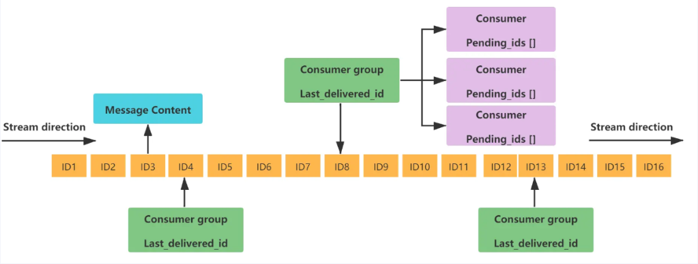

| 1    | Message Content   | 消息内容                                                     |
| ---- | ----------------- | ------------------------------------------------------------ |
| 2    | Consumer group    | 消费组，通过XGROUP CREATE 命令创建，同一个消费组可以有多个消费者 |
| 3    | Last_delivered_id | 游标，每个消费组会有个游标 last_delivered_id，任意一个消费者读取了消息都会使游标 last_delivered_id 往前移动。 |
| 4    | Consumer          | 消费者，消费组中的消费者                                     |
| 5    | Pending_ids       | 消费者会有一个状态变量，用于记录被当前消费已读取但未ack的消息Id，如果客户端没有ack，这个变量里面的消息ID会越来越多，一旦某个消息被ack它就开始减少。这个pending_ids变量在Redis官方被称之为 PEL(Pending Entries List)，记录了当前已经被客户端读取的消息，但是还没有 ack (Acknowledge character：确认字符），它用来确保客户端至少消费了消息一次，而不会在网络传输的中途丢失了没处理 |

#### 基本命令

**消息队列相关命令：**

- **XADD** - 添加消息到末尾
- **XTRIM** - 对流进行修剪，限制长度
- **XDEL** - 删除消息
- **XLEN** - 获取流包含的元素数量，即消息长度
- **XRANGE** - 获取消息列表，会自动过滤已经删除的消息
- **XREVRANGE** - 反向获取消息列表，ID 从大到小
- **XREAD** - 以阻塞或非阻塞方式获取消息列表

**消费者组相关命令：**

- **XGROUP CREATE** - 创建消费者组
- **XREADGROUP GROUP** - 读取消费者组中的消息
- **XACK** - 将消息标记为"已处理"
- **XGROUP SETID** - 为消费者组设置新的最后递送消息ID
- **XGROUP DELCONSUMER** - 删除消费者
- **XGROUP DESTROY** - 删除消费者组
- **XPENDING** - 显示待处理消息的相关信息
- **XCLAIM** - 转移消息的归属权
- **XINFO** - 查看流和消费者组的相关信息；
- **XINFO GROUPS** - 打印消费者组的信息；
- **XINFO STREAM** - 打印流信息

##### **XADD**

使用 XADD 向队列添加消息，如果指定的队列不存在，则创建一个队列，XADD 语法格式：

```
XADD key ID field value [field value ...]
```

- **key** ：队列名称，如果不存在就创建
- **ID** ：消息 id，我们使用 * 表示由 redis 生成，可以自定义，但是要自己保证递增性。
- **field value** ： 记录。


**实例**

```bash
redis> XADD mystream * name Sara surname OConnor
"1601372323627-0"
redis> XADD mystream * field1 value1 field2 value2 field3 value3
"1601372323627-1"
redis> XLEN mystream
(integer) 2
redis> XRANGE mystream - +
1) 1) "1601372323627-0"
   2) 1) "name"
      2) "Sara"
      3) "surname"
      4) "OConnor"
2) 1) "1601372323627-1"
   2) 1) "field1"
      2) "value1"
      3) "field2"
      4) "value2"
      5) "field3"
      6) "value3"
redis>
```


##### XRANGE

使用 XRANGE 获取消息列表，会自动过滤已经删除的消息 ，语法格式：

```
XRANGE key start end [COUNT count]
```

- **key** ：队列名
- **start** ：开始值， **-** 表示最小值
- **end** ：结束值， **+** 表示最大值
- **count** ：数量

实例

```bash
redis> XADD writers * name Virginia surname Woolf
"1601372577811-0"
redis> XADD writers * name Jane surname Austen
"1601372577811-1"
redis> XADD writers * name Toni surname Morrison
"1601372577811-2"
redis> XADD writers * name Agatha surname Christie
"1601372577812-0"
redis> XADD writers * name Ngozi surname Adichie
"1601372577812-1"
redis> XLEN writers
(integer) 5
redis> XRANGE writers - + COUNT 2
1) 1) "1601372577811-0"
   2) 1) "name"
      2) "Virginia"
      3) "surname"
      4) "Woolf"
2) 1) "1601372577811-1"
   2) 1) "name"
      2) "Jane"
      3) "surname"
      4) "Austen"
redis>
```

##### XREVRANGE

使用 XREVRANGE 获取消息列表，会自动过滤已经删除的消息 ，语法格式：

```
XREVRANGE key end start [COUNT count]
```

- **key** ：队列名
- **end** ：结束值， **+** 表示最大值
- **start** ：开始值， **-** 表示最小值
- **count** ：数量

**实例**

```bash
redis> XADD writers * name Virginia surname Woolf
"1601372731458-0"
redis> XADD writers * name Jane surname Austen
"1601372731459-0"
redis> XADD writers * name Toni surname Morrison
"1601372731459-1"
redis> XADD writers * name Agatha surname Christie
"1601372731459-2"
redis> XADD writers * name Ngozi surname Adichie
"1601372731459-3"
redis> XLEN writers
(integer) 5
redis> XREVRANGE writers + - COUNT 1
1) 1) "1601372731459-3"
   2) 1) "name"
      2) "Ngozi"
      3) "surname"
      4) "Adichie"
redis>
```

##### XDEL

使用 XDEL 删除消息，语法格式：

```
XDEL key ID [ID ...]
```

- **key**：队列名称
- **ID** ：消息 ID

**实例**

```bash
> XADD mystream * a 1
1538561698944-0
> XADD mystream * b 2
1538561700640-0
> XADD mystream * c 3
1538561701744-0
> XDEL mystream 1538561700640-0
(integer) 1
127.0.0.1:6379> XRANGE mystream - +
1) 1) 1538561698944-0
   2) 1) "a"
      2) "1"
2) 1) 1538561701744-0
   2) 1) "c"
      2) "3"
```


##### XTRIM

使用 XTRIM 对流进行修剪，限制长度， 语法格式：

```
XTRIM key MAXLEN [~] count
```

- **key** ：队列名称
- **MAXLEN** ：允许的最大长度
- **MINID**: 允许的最小ID
- **count** ：数量

**实例**

```bash
127.0.0.1:6379> XRANGE mystream - +
1726131510503-0
field1
A
field2
B
field3
C
field4
D
1726131675077-0
field5
E
field6
F
field7
G
127.0.0.1:6379> XTRIM mystream MAXLEN 1
1
127.0.0.1:6379> XRANGE mystream - +
1726131675077-0
field5
E
field6
F
field7
G
127.0.0.1:6379>
```

##### XREAD

> 只会返回大于指定ID的消息

使用 XREAD 以阻塞或非阻塞方式获取消息列表 ，语法格式：

```
XREAD [COUNT count] [BLOCK milliseconds] STREAMS key [key ...] id [id ...]
```

- **count** ：数量
- **milliseconds** ：可选，阻塞毫秒数，没有设置就是非阻塞模式
- **key** ：队列名
- **id** ：消息 ID

**实例**:

```bash
# 从 Stream 头部读取两条消息
> XREAD COUNT 2 STREAMS mystream writers 0-0 0-0
1) 1) "mystream"
   2) 1) 1) 1526984818136-0
         2) 1) "duration"
            2) "1532"
            3) "event-id"
            4) "5"
            5) "user-id"
            6) "7782813"
      2) 1) 1526999352406-0
         2) 1) "duration"
            2) "812"
            3) "event-id"
            4) "9"
            5) "user-id"
            6) "388234"
2) 1) "writers"
   2) 1) 1) 1526985676425-0
         2) 1) "name"
            2) "Virginia"
            3) "surname"
            4) "Woolf"
      2) 1) 1526985685298-0
         2) 1) "name"
            2) "Jane"
            3) "surname"
            4) "Austen"
```


#### XGROUP CREATE

使用 XGROUP CREATE 创建消费者组，语法格式：

```bash
XGROUP [CREATE key groupname id-or-$] [SETID key groupname id-or-$] [DESTROY key groupname] [DELCONSUMER key groupname consumername]
```

- **key** ：队列名称，如果不存在就创建
- **groupname** ：组名。
- **$** ： 表示从尾部开始消费，只接受新消息，当前 Stream 消息会全部忽略。

从头开始消费:

```
XGROUP CREATE mystream consumer-group-name 0  
```

从尾部开始消费:

```
XGROUP CREATE mystream consumer-group-name $
```

#### XREADGROUP GROUP

使用 XREADGROUP GROUP 读取消费组中的消息，语法格式：

```
XREADGROUP GROUP group consumer [COUNT count] [BLOCK milliseconds] [NOACK] STREAMS key [key ...] ID [ID ...]
```

- **group** ：消费组名
- **consumer** ：消费者名。
- **count** ： 读取数量。
- **milliseconds** ： 阻塞毫秒数。
- **key** ： 队列名。
- **ID** ： 消息 ID。
- `>` : 代表从第一条尚未被消费的消息开始读取

```
XREADGROUP GROUP consumer-group-name consumer-name COUNT 1 STREAMS mystream >
```

Stream以组为单位，一旦有一个消费者读取，相同组内的其他消费者将无法读取已被读取的消息


**消费者组的目的**

让组内的多个消费者共同分担读取消息，所以，我们通常会让每个消费者读取部分消息，从而实现消息读取负载在多个消费者间是均衡分布的


#### XPENGING

显示待处理消息的相关信息，即查询每个消费组内所有消费者<font color = "red">已读取，但尚未确认</font>的消息

```
XPENDING key group [[IDLE min-idle-time] start end count [consumer]]
```

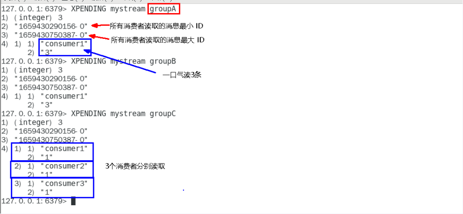


#### **XACK** 

将消息标记为"已处理"


#### **XINFO**

查看流和消费者组的相关信息

**XINFO GROUPS**：打印消费者组的信息

**XINFO STREAM** ：打印流信息

### Bitmap（位图）

即将一个Redis字符串看作是一个由二进制位组成的数组并能对变长位宽和任意没有字节对齐的指定整型位域进行寻址和修改。

**主要作用**

1. 位域修改
2. 溢出控制


#### 基本语法命令

> Ascii码表: https://ascii.org.cn/

```
BITFIELD key [GET type offset] [SET type offset value] [INCRBY type offset increment] [OVERFLOW WRAP|SAT|FAIL]
```


#### 位域修改

```bash
BITFIELD key [GET type offset]
```


```
BITFIELD key [SET type offset value]
```


```
BITFIELD key [INCRBY type offset increment]
```


#### 溢出控制

`WRAP`: 使用回绕（wrap around）方法处理有符号整数和无符号整数的溢出情况


`SAT`：使用饱和计算（saturation arithmetic）方法处理溢出，下溢计算的结果为最小的整数，而上溢出的结果为最大的整数值（-128 - 127）


`FAIL`: 命令将拒绝执行那些会导致上溢或下溢情况出现的计算，并向用户返回空值表示计算未被执行


# Redis持久化

## 总体介绍

将内存中的数据写到磁盘进行持久化保存


## RDB（Redis DataBase）

### 官网介绍

RDB（Redis 数据库）：RDB 持久性以指定的时间间隔执行数据集的时间点快照。

即在指定的时间间隔，执行数据集的时间点快照


### 作用

在指定的时间间隔内将内存中的数据集快照写入磁盘，也就是行话讲的Snapshot内存快照，它恢复时再将硬盘
快照文件直接读回到内存里

Redis的数据都在内存中，保存备份时它执行的是，<font color = 'red'>全量快照</font>，也就是说，把内存中的所有数据都记录到磁盘中。

最终保存到`dump.rdb`文件中


### 案例演示

#### 配置文件变化

**Redis6.0.16以前：**


**Redis6.2至Redis7:**


#### 操作步骤

##### **自动触发：**

在Redis7版本中，修改`redis.conf`中的 `save <seconds> <changes>` 信息


例如修改为5秒内2次修改则进行持久化保存到rdb文件中


**修改dump文件路径**：

默认情况下，`dump.rdb`文件保存到与`redis.conf`配置文件相同的目录内


我可以将其保存到自定义目录中


我们可以使用 `CONFIG GET parameter`来获取配置文件中的参数信息


**修改dump文件名：**

默认名称为`dump.rdb`


我们可以修改自定义文件名，比如加个端口号，配置集群时方便区分


**触发备份：**

> 时间间隔和写入次数同时满足时才会触发备份
>
> 使用shutdown命令也会触发一次自动备份

第一种情况：一次性写入两个key，自动备份成功


第二种情况：先写入一个key，没有自动保存，等待几秒中使其超过5秒时间间隔，再写入第二次时自动备份成功


**如何恢复：**

将备份文件(dump.rdb)移动到redis安装目录并启动服务即可

<font color = 'red'>注意：执行flushall/flushdb命令也会产生dump.rdb文件，但里面是空的，无意义</font>

所以物理恢复务必做到服务和备份<font color = 'red'>分机隔离</font>

即不可以把备份文件`dump.rdb`和生产redis服务器放在同一台机器，必须分开各自存储，以防止生产机物理损坏后备份文件也挂了的窘境。


##### 手动触发：

Redis提供了两个命令来生成RDB文件分别是`SAVE`和`BGSAVE`


**SAVE:**


在主程序中执行<font color = 'red'>会阻塞</font>当前Redis服务器，

**直到持久化工作完成，执行save命令期间，Redis不能处理其他命令**，<font color = 'red'>线上禁止使用`SAVE`命令进行备份操作</font>


**BGSAVE（默认）:**


Redis会在后台异步进行快照操作，<font color = 'red'>不阻塞</font>
快照同时还可以响应客户端请求，该触发方式会fork一个子进程由子进程复制持久化过程

Redis会使用bgsave对当前内存中的所有数据做快照，这个操作是子进程在后台完成的，这就允许主进程同时可以修改数据。

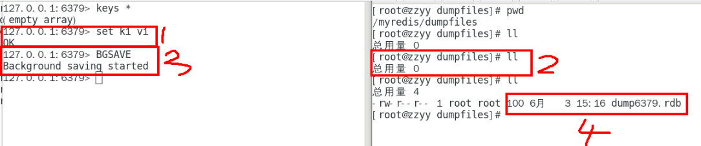


**怎么理解Fork？：**

生活中的案例：GitHub上Fork一份代码到自己仓库，自己修改时不影响原有仓库


在Linux程序中，`fork()`会产生一个和父进程完全相同的子进程，但子进程在此后会多执行系统调用，出于效率考虑，尽量避免膨胀。


**LASTSAVE:**

可以通过lastsave命令获取最后一次成功执行快照的时间


再Linux中可以使用 `date -d @时间戳`将时间戳转换为可以识别的日期时间


### RDB优势

#### 官网说明


#### 小总结

1. 适合大规模的数据恢复
2. 按照业务定时备份
3. 对数据完整性和一致性要求不高
4. RDB文件在内存中的加载速度要比AOF快得多

### RDB劣势

#### 官网说明


#### 小总结

1. 在一定间隔时间做一次备份，所以如果Redis意外宕机，就会丢失从当前至最近一次快照期间的数据，，<font color = 'red'>快照之间的数据会丢失</font>。
2. 内存数据的全量同步，如果数据量太大会导致I/0严重影响服务器性能
3. RDB依赖于主进程的Fok,在更大的数据集中，这可能会导致服务请求的瞬间延迟。Fork的时候内存中的数据被克隆了一份，大致2倍的膨胀性，需要考虑

### 数据丢失案例

正常录入数据，k1，k2已进行备份，写入k3后模拟服务器意外宕机


使用`kill`命令杀掉`redis-server`进程


恢复服务后，重新查看数据，k3数据丢失


### 如何修复`dump.rdb`文件？

可以使用`redis-check-rdb` 命令尝试修复，但未必能够修复成功


### 哪些情况会触发RDB快照？

1. 配置文件中默认的快照配置
2. 手动save/bgsave命令
3. 执行flushall/flushdb命令也会产生`dump.rdb`文件，但里面是空的，无意义
4. 执行shutdown且没有设置开启AOF持久化
5. 主从复制时，主节点自动触发

### 如何禁用RDB快照？

1. 动态停止所有RDB保存规则的方法：`redis-cli config set save ""`
2. 禁用快照，直接修改`redis.conf`配置文件 `save ""`

​		

### RDB优化配置项

1、`SAVE<seconds> <changes>`

2、`dbfilename`

3、`dir`

4、`stop-writes-on-bgsave-error`


5、`rdbcompression`


6、`rdbchecksum`


7、`rdb-del-sync-files`


### 小总结


## AOF（Append Only File）

### 官网介绍


<font color = 'red'>以日志的形式来记录每个**写**操作</font>，将Rdis执行过的所有写指令记录下来（读操作不记录），只许追加文件但不可以改写文件，Redis启动之初会读取该文件重新构建数据，换言之，Redis重启的话就根据日志文件的内容将写指令从前到后执行一次以完成数据的恢复工作。

默认情况下，Redis是没有开启AOF(append only file)的。开启AOF功能需要设置配置：`appendonly yes`


Aof保存的是`appendonly.aof`文件

### AOF持久化工作流程

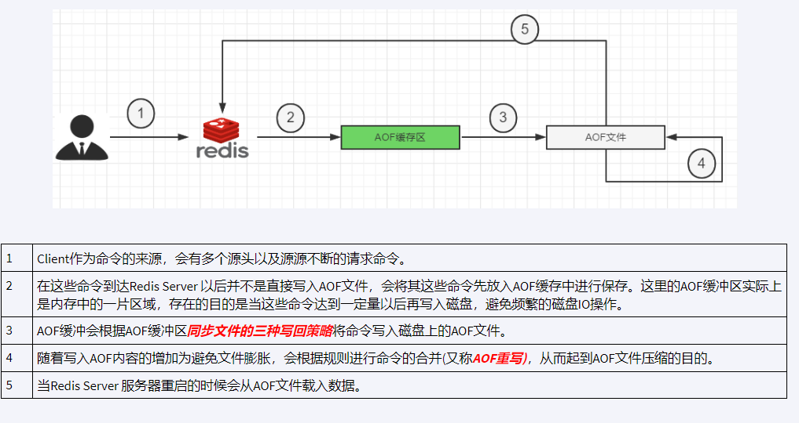

### AOF缓冲区三种写回策略

1、Always

同步写回，每个写命令执行完立刻同步地将日志写回磁盘

2、everysec

每秒写回，每个写命令执行完，只是先把日志写到AOF文件的内存缓冲区，每隔1秒把缓冲区中的内容写入磁盘

3、no

操作系统控制的写回，每个写命令执行完，只是先把日志写到AOF文件的内存缓冲区，由操作系统决定何时将缓冲区内容写回磁盘


### AOF配置文件说明

#### 如何开启AOF?


使用默认写回策略，每秒钟


#### AOF文件保存路径

**Redis6:**

AOF保存文件的位置和RDB保存文件的位置一样，都是通过`redis.conf`配置文件的`dir`配置


**Redis7:**

Redis7在原来`dir`目录的基础上多了一层目录 `appenddirname`


AOF最终目录为： `dir`+ `appenddirname`


#### AOF文件保存名称

Redis7采用 Multi Part AOF的设计，即由多部份组成


包含三部分：

**1、base基本文件**

**2、incr增量文件**

**3、mainfest清单文件**


**Redis7中对应的配置项**


### AOF修复/恢复

#### 正常恢复

1、重启Redis然后加载数据 OK

2、写入数据到Redis，然后flushdb + shutdown服务器

新生成了dump.rdb 及 aof 文件，备份新生成的aof.bak，然后删除aof文件，重启Redis然后重新加载

结果无数据，原因是flushdb也是写操作，也回被记录到aof文件中

再次停止服务器，恢复原来备份的有数据的aof文件再重启服务查看  数据恢复

#### 异常修复

故意乱写正常的AOF文件，模拟网络中断导致文件写入错误


重启Redis之后就会进行AOF文件的载入，发现启动都不行


异常修复命令：`redis-check-aof--fiX`进行修复


重新启动并查询数据成功


### AOF优势


### AOF劣势


### AOF重写机制

#### 介绍

由于AOF持久化是Redis不断将写命令记录到 AOF 文件中，随着Redis不断的进行，AOF 的文件会越来越大，文件越大，占用服务器内存越大以及 AOF 恢复要求时间越长。

为了解决这个问题，<font color = 'red'> Redis新增了重写机制</font>，当AOF文件的大小超过所设定的峰值时，Redis就会<font color = 'red'>自动</font>启动AOF文件的内容压缩，只保留可以恢复数据的最小指令集或者可以**手动使用命令 `bgrewriteaof` 来重新。**

#### 触发机制

**官网默认配置：**


**自动触发：**

满足配置文件中的选项后，Rediss会记录上次重写时的AOF大小，默认配置是当AOF文件大小是上次rewrite后大小的一倍且文件大于64M时


**手动触发：**

客户端向服务器发送`bgrewriteaof`命令

#### AOF重写原理

1：在重写开始前，redis会创建一个“重写子进程”，这个子进程会读取现有的AOF文件，并将其包含的指令进行分析压缩并写入到一个临时文件中。

2：与此同时，主进程会将新接收到的写指令一边累积到内存缓冲区中，一边继续写入到原有的AOF文件中，这样做是保证原有的AOF文件的可用性，避免在重写过程中出现意外。

3：当“重写子进程”完成重写工作后，它会给父进程发一个信号，父进程收到信号后就会将内存中缓存的写指令追加到新AOF文件中

4：当追加结束后，redis就会用新AOF文件来代替旧AOF文件，之后再有新的写指令，就都会追加到新的AOF文件中

5：重写aof文件的操作，并没有读取旧的aof文件，而是将整个内存中的数据库内容用命令的方式重写了一个新的aof文件，这点和快照有点类似

### AOF优化配置项详解


#### 小总结


## RDB + AOF混合模式

RDB特久化方式能够在指定的时间间隔能对你的数据进行快照存储

AOF持久化方式记录每次对服务器写的操作，当服务器重启的时候会重新执行这些命令来恢复原始的数据，AOF命令以Redis协议追加保存每次写的操作到文件末尾

RDB 和 AOF两种持久化方式可以共存

同时开启两种持久化方式时，<font color = 'red'>当Redis重启的时候会优先载入AOF文件来恢复原始的数据</font>,因为在通常情况下AOF文件保存的数据集要比RDB文件保存的数据集要完整。

RDB的数据不实时，同时使用两者时服务器重启也只会找AOF文件。那要不要只使用AOF呢？
作者建议不要，因为RDB更适合用于备份数据库(AOF在不断变化不好备份)，留着db作为一个万一的手段。


**RDB + AOF混合模式：**

结合了RDB和AOF的优点，既能快速加载又能避免丢失过多的数据。

1、开启混合方式设置

设置`aof-use-rdb-preamble`的值为 `yes`  yes表示开启，设置为no表示禁用

2、 RDB+AOF的混合方式 结论：<font color = 'red'>RDB镜像做全量持久化，AOF做增量持久化</font>

先使用RDB进行快照存储，然后使用AOF持久化记录所有的写操作，当重写策略满足或手动触发重写的时候，<font color = 'red'>将最新的数据存储为新的RDB记录</font>。这样的话，重启服务的时候会从RDB和AOF两部分恢复数据，既保证了数据完整性，又提高了恢复数据的性能。简单来说：混合持久化方式产生的文件一部分是RDB格式，一部分是AOF格式

**<font color = 'red' >AOF包括了RDB头部+AOF混写</font>**


## 纯缓存模式

即同时关闭RDB及AOF，采用其他实现持久化操作，Redis只做缓存功能

**禁用RDB:**

> 禁用rdb持久化模式下，我们仍然可以使用命令save、bgsave生成rdb文件

配置 `save ""`

### 禁用AOF

> 禁用aof特久化模式下，我们仍然可以使用命令bgrewriteaof生成aof文件

配置 `appendonly no`


# Redis 事务

## 介绍

> https://redis.io/docs/manual/transactions/

可以一次执行多个命令，本质是一组命令的集合。一个事务中的所有命令都会序列化，<font color = 'red'>按顺序地串行化执行而不会被其它命令插入，不许加塞</font>

## 作用

一个队列中，一次性、顺序性、排他性的执行一系列命令

## Redis事务与数据库事务的区别

1 、单独的隔离操作

Redis的事务仅仅是保证事务里的操作会被连续独占的执行，<font color = 'red'>redis命令执行是单线程架构</font>，在执行完事务内所有指令前是不可能再去同时执行其他客户端的请求的

2 、没有隔离级别的概念

 因为事务提交前任何指令都不会被实际执行，也就不存在”事务内的查询要看到事务里的更新，在事务外查询不能看到”这种问题了

3、不保证原子性

 Redis的事务<font color = 'red'>不保证原子性</font>，也就是不保证所有指令同时成功或同时失败，只有决定是否开始执行全部指令的能力，没有执行到一半进行回滚的能力

4、 排它性

Redis会保证一个事务内的命令依次执行，而不会被其它命令插入

## 使用

### 常用命令

下表列出了 redis 事务的相关命令：

| 序号 | 命令及描述                                                   |
| :--- | :----------------------------------------------------------- |
| 1    | [DISCARD](https://www.runoob.com/redis/transactions-discard.html) 取消事务，放弃执行事务块内的所有命令。 |
| 2    | [EXEC](https://www.runoob.com/redis/transactions-exec.html) 执行所有事务块内的命令。 |
| 3    | [MULTI](https://www.runoob.com/redis/transactions-multi.html) 标记一个事务块的开始。 |
| 4    | [UNWATCH](https://www.runoob.com/redis/transactions-unwatch.html) 取消 WATCH 命令对所有 key 的监视。 |
| 5    | [WATCH key [key ...\]](https://www.runoob.com/redis/transactions-watch.html) 监视一个(或多个) key ，如果在事务执行之前这个(或这些) key 被其他命令所改动，那么事务将被打断。 |

### 不用场景说明

#### 场景一：正常执行


#### 场景二：放弃事务


#### 场景三：全体连坐


#### 场景四：冤头债主

非编译错误，在执行时出错，其他命令不受影响


#### 场景五：watch监控

> Redis使用Watch来提供乐观锁定，类以于CAS(Check-and-Set）

**CAS回顾：**

1、悲观锁

 悲观锁(Pessimistic Lock), 顾名思义，就是很悲观，每次去拿数据的时候都认为别人会修改，所以每次在拿数据的时候都会上锁，这样别人想拿这个数据就会block直到它拿到锁。

2、乐观锁

 乐观锁(Optimistic Lock), 顾名思义，就是很乐观，每次去拿数据的时候都认为别人不会修改，所以不会上锁，但是在更新的时候会判断一下在此期间别人有没有去更新这个数据。

<font color = 'red'>乐观锁策略:提交版本必须  大于  记录当前版本才能执行更新</font>

3、CAS


**Watch:**

初始化k1和balance两个key,先监控再开启multi，保证两key变动在同一个事务内


**watch命令是一种乐观锁的实现，Redis在修改的时候会检测数据是否被更改，如果更改了，则执行失败**

**第一个窗口蓝色框第5步执行结果返回为空，也就是相当于是失败，笔记见最下面官网说明**


**unwatch:**


**小结：**

一旦执行了exec之前加的监控锁都会被取消

当客户端连接丢失的时候（比如退出链接），所有东西都会被取消监视


## Redis事务总结

**开启**：以`MUTI`开始一个事务

**入队**：将多个命令入队到事务中，接到这些命令并不会立即执行，而是放到等待执行的事务队列里面

**执行**：由`EXEC`命令触发事务


# Redis管道（pipeline）

> 开篇先来个面试题

## **如何优化频繁命令往返造成的性能瓶颈？**

Redis是一种基于<font color = 'red'>客户端-服务端模型</font>以及请求/响应协议的TCP服务。一个请求会遵循以下步骤：

1 、客户端向服务端发送命令分四步(发送命令→命令排队→命令执行→返回结果)，并监听Socket返回，通常以阻塞模式等待服务端响应。

2、服务端处理命令，并将结果返回给客户端。

**<font color = 'red'>上述两步称为：Round Trip Time(简称RTT,数据包往返于两端的时间)</font>**


如果同时需要执行大量的命令，那么就要等待上一条命令应答后再执行，这中间不仅仅多了**RTT**（Round Time Trip），而且还频繁调用系统IO，发送网络请求，同时需要Redis调用多次`read()`和`write()`系统方法，系统方法会将数据从用户态转移到内核态，这样就会对进程上下文有比较大的影响了，性能不太好

对于上述问题的解决思路就是采用管道(pipeline)


## Redis管道介绍

> 官网介绍： https://redis.io/docs/manual/pipelining/

Pipeline是为了解决RTT往返回时，仅仅是将命令打包一次性发送，对整个Redis的执行不造成其它任何影响

<font color = 'red'>是批做处理命令变种优化措施</font>，类似Redis的原生批命令(mget和mset)


## 案例演示

可以将所有要批量执行的命令写入到一个文件中，然后使用 `--pipe` 命令参数执行


## Redis管道小总结

### Pipeline与原生批量命令对比

1. 原生批量命令是原子性（例如：mset,mget),pipeline是非原子性
2. 原生批量命令一次只能执行一种命令，pipeline支持批量执行不同命令
3. 原生批命令是服务端实现，而pipeline需要服务端与客户端共同完成

### Pipeline与Redis事务对比

1. 事务具有原子性(不保证)，管道不具有原子性
2. 管道一次性将多条命令发送到服务器，事务是一条一条的发，事务只有在接收到exec命令后才会执行，管道不会
3. 执行事务时会阻塞其他命令的执行，而执行管道中的命令时不会

## 使用Pipeline注意事项

1. pipelines缓冲的指令只是会依次执行，不保证原子性，如果执行中指令发生异常，将会继续执行后续的指令
2. 使用pipeline组装的命令个数不能太多，不然数据量过大客户端阻塞的时间可能过久，同时服务端此时也被迫回复一个队列答复，占用很多内存。


# Redis发布订阅

> 专业的事情交给专业的中间件处理，了解即可

## 介绍

> 官网介绍： https://redis.io/docs/manual/pubsub/

是一种消息通信模式：发送者(PUBLISH)发送消息，订阅者(SUBSCRIBE)接收消息，可以实现进程间的消息传递

Redis可以实现消息中间件MQ的功能，通过发布订阅实现消息的引导和分流。

## 作用

Redis客户端可以订阅任意数量的频道，类似我们微信关注多个公众号


当有新消息通过PUBLISH命令发送给频道channel1时


## 常用命令

下表列出了 redis 发布订阅常用命令：

| 序号 | 命令及描述                                                   |
| :--- | :----------------------------------------------------------- |
| 1    | [PSUBSCRIBE pattern [pattern ...\]](https://www.runoob.com/redis/pub-sub-psubscribe.html) 订阅一个或多个符合给定模式的频道。 |
| 2    | [PUBSUB subcommand [argument [argument ...\]]](https://www.runoob.com/redis/pub-sub-pubsub.html) 查看订阅与发布系统状态。 |
| 3    | [PUBLISH channel message](https://www.runoob.com/redis/pub-sub-publish.html) 将信息发送到指定的频道。 |
| 4    | [PUNSUBSCRIBE [pattern [pattern ...\]]](https://www.runoob.com/redis/pub-sub-punsubscribe.html) 退订所有给定模式的频道。 |
| 5    | [SUBSCRIBE channel [channel ...\]](https://www.runoob.com/redis/pub-sub-subscribe.html) 订阅给定的一个或多个频道的信息。 |
| 6    | [UNSUBSCRIBE [channel [channel ...\]]](https://www.runoob.com/redis/pub-sub-unsubscribe.html) 指退订给定的频道。 |


<font color = 'red'> 推荐先执行订阅后再发布，订阅成功之前发布的消息是收不到的 </font>

## 缺点

1. 发布的消息在Rds系统中不能持久化，因此，必须先执行订阅，再等待消息发布。如果先发布了消息，那么该消息由于没有订阅者，消息将被直接丢弃。
2. 消息只管发送对于发布者而言消息是即发即失的，不管接收，也没有ACK机制，无法保证消息的消费成功
3. 以上的缺点导致Redis的Pub/Sub模式就像个小玩具，在生产环境中几乎无用武之地，为此Redis5.0版本新增了Stream数据结构，不但支持多播，还支持数据持久化，相比Pub/Sub更加的强大


# Redis复制（Replication）

## 介绍

> 官网介绍： https://redis.io/docs/management/replication/

就是主从复制，master以写为主，Slave以读为主

当master数据变化的时候，自动将新的数据异步同步到其它slave数据库

## 作用

1. 读写分离
2. 容灾恢复
3. 数据备份
4. 水平扩容支撑高并发

## 使用

### 注意点

1. <font color = 'red'>配从(库)不配主(库)</font>
2. Master如果配置了`requirepass`参数，需要密码登陆，那么Slave就要配置`masterauth`来设置校验密码，
   否则Master会拒绝Slave的访问请求

### 基本命令

1、**info replication**：

可以查看复制节点的主从关系和配置信息

2、**replicaof 主库IP 主库端口:**

设置从节点的主节点

一般写入进`redis.conf`配置文件内

3、**slaveof 主库IP 主库端口:**

每次与master断开之后，都需要重新连接，除非你配置进`redis.conf`文件

在运行期间修改slave节点的信息，如果该数据库已经是某个主数据库的从数据库，那么会停上和原主数据库的同步关系<font color = 'red'>转而和新的主数据库同步，重新拜码头</font>

4、**slaveof no one：**

使当前数据库停止与其他数据库的同步，<font color = 'red'>转成主数据库，自立为王</font>


### 案例演示

#### 架构说明

个Master两个Slave，需要3台虚机，每台都安装redis


#### 操作步骤

1、三边网络相互ping通且注意防火墙配置

2、拷贝多个`redis.conf`文件

```bash
# 192.168.10.66  redis_6379.conf
bind 0.0.0.0
daemonize yes
protected-mode no
port 6379
logfile "/my-redis7/redis6379.log"
pidfile /my-redis7/redis6379.pid
dir /my-redis7
dbfilename dump6379.rdb
appendonly yes
appendfilename "appendonly6379.aof"
requirepass shiguang
masterauth shiguang

# 192.168.10.88  redis_6378.conf
bind 0.0.0.0
daemonize yes
protected-mode no
port 6378
logfile "/my-redis7/redis6378.log"
pidfile /my-redis7/redis6378.pid
dir /my-redis7
dbfilename dump6378.rdb
appendonly yes
appendfilename "appendonly6378.aof"
requirepass shiguang
replicaof 192.168.10.66 6379
masterauth shiguang

# 192.168.10.99  redis_6380.conf
bind 0.0.0.0
daemonize yes
protected-mode no
port 6380
logfile "/my-redis7/redis6380.log"
pidfile /my-redis7/redis6380.pid
dir /my-redis7
dbfilename dump6380.rdb
appendonly yes
appendfilename "appendonly6380.aof"
requirepass shiguang
replicaof 192.168.10.66 6379
masterauth shiguang
```


### 修改配置文件细节

1、开启后台启动`daemonize yes`


2、注释绑定IP `bind 127.0.0.1`


3、关闭保护模式 `protected-mode no	`


4、指定端口 `port <port>`


5、指定当前工作目录 `dir <path>`


6、pid文件名字，`pidfile <path>`


7、日志文件名称 `logfile <path>`


8、本机访问密码 `requirepass <password>`


9、`rdb`文件名称 `dbfilename <filename>`


10、`aof`文件名称  `appendfilename <filename>`

需启用`aof`: `appendonly yes`


可选步骤，默认为 `appendonly.aof`

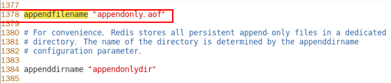

<font color = 'red'>11、从机访问主机的通行密码`masterauth`，从机必须配置</font>


#### 三大命令

1、**主从复制：**

replicaof 主库IP 主库端口

<font color = 'red'>配从（库）不配主（库）</font>

2、**该换门庭：**

slaveof 新主库IP 新主库端

3、**自立为王：**

slaveof no one


#### 一主二仆

**方案一：配置文件固定写死 `replicaof 主机IP 主机端口`**

配从不配主，分别配置从机 `192.168.10.88`  :`redis_6378.conf`，`192.168.10.99`: ` redis_6380.conf`

```bash
# 192.168.10.88  redis_6378.conf
replicaof 192.168.10.66 6379
masterauth shiguang

# 192.168.10.99  redis_6380.conf
replicaof 192.168.10.66 6379
masterauth shiguang
```

先启动Master，后启动Slaver

**主从关系查看：**

1、日志

主机日志


从机日志


2、命令 `info replication`

主机


从机


**主从问题**

**1、从机可以执行写命令吗？**

答：不可以


**2、从机切入点问题**

 slave是从头开始复制还是从切入点开始复制?

 master启动，写到k3

 slave1跟着master同时启动，跟着写到k3

 slave2写到k3后才启动，那之前的是否也可以复制？

答： 是，首次一锅端，后续跟随，master写，slave跟

**3、主机shutdown后，从机会上位吗？**

答：不会，从机不动，原地待命，从机数据可以正常使用；等待主机重启动归来


**4、主机shutdown，重启后主从关系还在吗？从机还能否顺利复制？**

答： 主从关系还在，从机仍可以顺利复制

**5、某台从机shutdown后，master继续写入，从机重启后还能读取新写入的内容吗？**

答：可以，同问题2


**方案二：命令操作手动指定**

从机停机去掉配置文件中的配置项，让3台都是主机状态，各不从属

使用 `slaveof 主库IP 主库端口`进行指定


**使用命令指定Master，从机重启后主从关系还在吗？**

答： 不再了，使用命令指定是临时性的。


#### 新货相传

上一个slave可以是下一个slave的master,slavel同样可以接收其他slaves的连接和同步请求

<font color = 'red'> slave成为其他slave的master，本质仍然是slave，不能执行写操作</font>

<font color = 'red'>中途变更转向：会清除之前的数据，重新建立拷贝最新的</font>


#### 反客为主

使当前数据库停止与其他数据库的同步，转成主数据库

命令： `slaveof no one`


## 复制原理和工作流程

1、slave启动，同步初请

slave启动成功连接到master后会发送一个`sync`命令

slave首次全新连接master,一次完全同步（全量复制）将被自动执行，slave自身原有数据会被master数据覆盖清除

2、首次连接，全量复制

naster节点收到`sync`命令后会开始在后台保存快照（即RDB特久化，主从复制时会触发RDB),同时收集所有接收到的用于修改数据集命令缓存起来，master节点执行RDB持久化完后，master将rdb快照文件和所有缓存的命令发送到所有slave,以完成一次完全同步

3、心跳持续，保持通信

可在配置文件修改ping包的周期，`repl-ping-replica-period <second>`

master发出PING包的周期，默认是10秒


4、进入平稳，增量复制

Master继续将新的所有收集到的修改命令自动依次传给slave,完成同步

5、从机下线，重连续传

master会检查backlog里面的offset,master和slave都会保存一个复制的offseti还有一个masterId,offset是保存在backlog中的。<font color = 'red'>Master只会把已经复制的offset后面的数据复制给Slave</font>,类似断点续传


## 复制缺点

1、复制延时，信号衰减

由于所有的写操作都是先在Master上操作，然后同步更新到Slave上，所以从Master同步到Slave机器有一定的延迟，当系统很繁忙的时候，延迟问题会更加严重，Slave机器数量的增加也会使这个问题更加严重。


2、Masetr宕机后从机不能上位为新的Master

默认情况下，不会在slave节点中自动重选一个master，需要进行人工干预。


# Redis哨兵（Sentinel）

## 介绍

吹哨人巡查监控后台master主机是否故障，如果故障了根据<font color = 'red'>投票数</font>自动将某一个从库转换为新主库，继续对外服务

## 作用

> 俗称: 无人值守运维

1、监控Redis运行状态，包括master和slave

2、当master down机，能自动将slave切换成新master


## 主要功能

1、主从监控

监控主从Redis库运行是否正常

2、故障转移
如果Master异常，则会进行主从切换，将其中一个Slave作为新Master

3、消息通知
哨兵可以将故障转移的结果发送给客户端

4、配置中心

客户端通过连接哨兵来获得当前Redis服务的主节点地址

## 实战演练

### 架构说明

3个哨兵 + 一主二从


哨兵负责监控和维护集群，不存放数据，只是吹哨人

一主二从用于数据读取和存放

### 案例步骤

1、/my-redis7 目录下新建或拷贝`sentinel.conf`文件，文件名称不可改


2、修改哨兵配置文件

> 可将哨兵配置到不同机器，此处全配置到192.168.10.66

配置文件如下

```bash
# sentinel26379.conf
bind 0.0.0.0
daemonize yes
protected-mode no
port 26379
logfile "/my-redis7/sentinel26379.log"
pidfile /var/run/redis-sentinel26379.pid
dir /my-redis7
sentinel monitor mymaster 192.168.10.66 6379 2
sentinel auth-pass mymaster shiguang

# sentinel26380.conf
bind 0.0.0.0
daemonize yes
protected-mode no
port 26380
logfile "/my-redis7/sentinel26380.log"
pidfile /var/run/redis-sentinel26380.pid
dir /my-redis7
sentinel monitor mymaster 192.168.10.66 6379 2
sentinel auth-pass mymaster shiguang


# sentinel26381.conf
bind 0.0.0.0
daemonize yes
protected-mode no
port 26381
logfile "/my-redis7/sentinel26381.log"
pidfile /var/run/redis-sentinel26381.pid
dir /my-redis7
sentinel monitor mymaster 192.168.10.66 6379 2
sentinel auth-pass mymaster shiguang
```

3、配置一主二从关系

66机器上新建`redis6379.conf`配置文件并设置`masterauth`项访问密码为`shiguang`，不然后续可能报错`master_link_status:down`，因为Master下线变为从机后需要访问新的Master

88机器上新建`redis_6378.conf`配置文件，设置好`replicaof <masterip> <masterport>`

99机器上新建`redis_6380.conf`配置文件，设置好`replicaof <masterip> <masterport>`

4、分别启动三台服务并测试主从复制是否正常


5、分别启动三个哨兵

`redis-sentinel /path/to/sentinel.conf`

 或者 

`redis-server /path/to/sentinel.conf --sentinel`

```bash
redis-sentinel /my-redis7/sentinel26379.conf 
redis-sentinel /my-redis7/sentinel26380.conf 
redis-sentinel /my-redis7/sentinel26381.conf
```
Master 主机服务如下，一台Redis服务，三个哨兵服务


查看其中一个哨兵日志

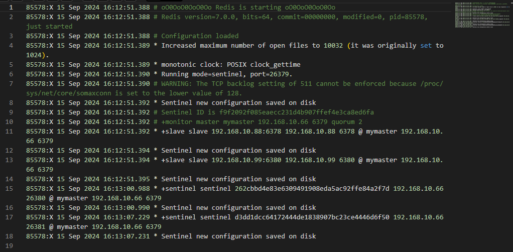

6、手动shutdown将6379下线，模拟master宕机

思考几个问题

**1、两台从机数据是否正常?**

**2、是否会从剩下两台机器中选出新的master?**

**3、之前的master重新恢复后，谁是老大，会不会master冲突？**

答案揭晓

**1、两台从机数据正常，但是可能会出现下面两个问题**


**认识broken pipe**


pipe是管道的意思，管道里面是数据流，通常是从文件或网络套接字读取的数据。当该管道从另一端突然关闭时，会发生数据突然中断，即是broken，对于socket来说，可能是网络被拔出或另一端的进程崩溃

**解决问题**

当该异常产生的时候，对于服务端来说，并没有多少影响。因为可能是某个客户端突然中止了进程导致了该错误

**Broken Pipe总结**

这个异常是客户端读取超时关闭了连接,这时候服务器端再向客户端已经断开的连接写数据时就发生了broken pipe异常！

**2、会重新投票选出新的Master**


**3、之前的Master恢复后继续延用新选出的Master**


### `sentinel.conf`参数说明

1、`bind`
服务监听地址，用于客户端连接，默认本机地址
2、`daemonize`
是否以后台daemon方式运行
3、`protected-mode`
安全保护模式
4、`port`
端口
5、`logfile`
日志文件路径
6、`pidfile`
pid文件路径
7、`dir`
工作目录

8、`sentinel monitor <master-name> <ip> <redis-port> <quorum>`

设置要监控的master服务器

`quorum`表示最少有几个哨兵认可客观下线，同意故障迁移的法定票数


9、`sentinel auth-pass <master-name> <password>`

master设置了密码，连接master服务的密码 

10、其他

```bash
# 指定多少毫秒之后，主节点没有应答哨兵，此时哨兵主观上认为主节点下线

sentinel down-after-milliseconds <master-name> <milliseconds>：
 
# 表示允许并行同步的slave个数，当Master挂了后，哨兵会选出新的Master，此时，剩余的slave会向新的master发起同步数据
sentinel parallel-syncs <master-name> <nums>：


# 故障转移的超时时间，进行故障转移时，如果超过设置的毫秒，表示故障转移失败
 

sentinel failover-timeout <master-name> <milliseconds>：

# 配置当某一事件发生时所需要执行的脚本
sentinel notification-script <master-name> <script-path> ：

 # 客户端重新配置主节点参数脚本

sentinel client-reconfig-script <master-name> <script-path>：
```


### 配置文件变化

<font color = 'red '>配置文件的内容，在运行期间会被sentinel动态进行更改</font>

<font color = 'red '>Master、Slave切换后，Master、Slave的`redis.conf`、和`sentinel.conf`的内容都会发生改变
</font>

Master `redis.conf`中会多一行`replicaof`的配置


`sentinel.conf`的监控目标会随之调换


### 其他说明

1、生产都是不同机房不同服务器，很少出现3个哨兵全挂掉的情况

2、可以同时监控多个master,一行一个


## 哨兵运行流程和选举原理

> 一般建议sentinel采取奇数台，Sentinel 在选举新的主节点时需要达到法定人数。奇数台 Sentinel 可以更容易地达成多数派，避免出现平局的情况。

### 1、SDown主观下线（Subjectively Down）

SDOWN(主观不可用)是<font color = 'red'>单个sentinel自己主观上</font>检测到的关于master的状态，从sentinel的角度来看，如果发送了PING心跳后，在一定时间内没有收到合法的回复，就达到了SDOWN的条件。

Sentineli配置文件中的`down-after-millisecondsi`设置了判断主观下线的时间长度


### 2、ODown客观下线(Objectively Down)

ODOWN需要一定数量的Sentinel,<font color = 'red'>多个哨兵达成一致意见</font>才能认为一个master客观上已经宕掉

四个参数含义：

masterName是对某个master+slave组合的一个区分标识(一套sentinel可以监听多组master+slave这样的组合)


**<font color = 'red'>quorum这个参数是进行客观下线的一个依据</font>**，法定人数/法定票数

意思是至少有quorum个sentinel认为这个master有故障才会对这个master进行下线以及故障转移。因为有的时候，某个sentinel节点可能因为自身网络原因导致无法连接master，而此时master并没有出现故障，所以这就需要多个sentinel都一致认为该master有问题，才可以进行下一步操作，这就保证了公平性和高可用。

### 3、选举出领导者哨兵（哨兵中选出兵王）

当主节点被判断客观下线以后，各个哨兵节点会进行协商，先选举出一个领导者哨兵节点（兵王）并由该领导者节点，也即被选举出的兵王进行`failover`(故障迁移)


**哨兵领导者，兵王如何洗出来的？**

 

监视该主节点的所有哨兵都有可能被选为领导者，选举使用的算法是Raft算法；Raft算法的基本思路**是先到先得**：

即在一轮选举中，哨兵A向B发送成为领导者的申请，如果B没有同意过其他哨兵，则会同意A成为领导者

### 4、由兵王开始推动故障切换流程并选出一个新master

#### 第一步：新主登基

> 某个Slave被选中成为新Master

**选出新master的规则**:


1、剩余slave节点健康前提下，`redis.conf`文件中，优先级`slave-priority`或者`replica-priority`最高的从节点（数字越小优先级越高


2、复制偏移位置offset最大的从节点

3、最小Run Id的从节点（字典顺序，ASCII码）

#### 第二步：群臣俯首

> 朝天子一朝臣，换个码头重新拜

执行`slaveof no one`命令让选出来的从节点成为新的主节点，并通过`replicaof`命令让其他节点成为其从节点

#### 第三步：旧主拜服

> 老masterl回来也认怂

将之前已下线的老masteri设置为新选出的新master的从节点，当老master重新上线后，它会成为新master的从节点

Sentinel leader会让原来的master降级为slave并恢复正常工作。

#### 小总结

上述的`failover`操作均由sentinel自己独自完成，完全无需人工干预，


### 哨兵使用建议

1、哨兵节点的数量应为多个，哨兵本身应该集群，保证高可用

2、哨兵节点的数量应该是奇数

3、个哨兵节点的配置应一致

4、如果哨兵节点部署在Docker等容器里面，尤其要注意端口的正确映射

5、<font color = 'red'>哨兵集群+主从复制，并不保证数据零丢失</font>


# Redis集群（Cluster）

## 介绍

> 官网介绍：https://redis.io/docs/latest/operate/oss_and_stack/reference/cluster-spec/

**<font color = 'red'>由于数据量过大</font>**，单个Master复制集难以承担，因此需要对多个复制集进行集群，形成水平扩展每个复制集只负责存储整个数据集的一部分，这就是Redis的集群，其作用是提供在多个Redis节点间共享数据的程序集。


Redis集群是一个提供在多个Redis节点间共享数据的程序集，<font color = 'red'>Redis集群可以支持多个Master</font>

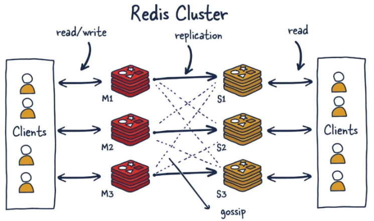

## 作用

1、Redis集群支持多个Master,每个Master又可以挂载多个Slave

- 读写分离
- 支持数据的高可用
- 支持海量数据的读写存储操作

2、由于Cluster自带Sentinel的故障转移机制，内置了高可用的支持，<font color = 'red'>无需再去使用哨兵功能</font>

3、客户端与Rdis的节点连接，不再需要连接集群中所有的节点，只需要任意连接集群中的一个可用节点即可

4、<font color = 'red'>槽位slot</font>负责分配到各个物理服务节点，由对应的集群来负责维护节点、插槽和数据之间的关系


## 集群算法：分片-槽位（slot）

### 官网介绍


### Slot介绍


### 分片介绍


### 插槽和分片的优势


### Slot槽位映射方案

#### 方案一：哈希取余分区


#### 方案二：一致性哈希算法分区

##### **一致性Hash算法背景**

一致性哈希算法在1997年由麻省理工学院中提出的，设计目标是为了解决分布式缓存数据变动和映射问题，某个机器宕机了，分母数量改变了，自然取余数不OK了。

##### **作用**

提出一致性Hash解决方案。目的是当服务器个数发生变动时，尽量减少影响客户端到服务器的映射关系

##### **实现步骤**

1、算法构建一致性哈希环


2、Redis服务器IP节点映射


3、Key落到Redis服务器的落键规则


##### 优点

1、容错性方面


2、拓展性方面


##### 缺点

节点太少时，会产生数据倾斜问题


##### 小总结

为了在节点数目发生改变时尽可能少的迁移数据，将所有的存储节点排列在收尾相接的Hash环上，每个key在计算Hash后会<font color = 'red'>顺时针</font>找到临近的存储节点存放。而当有节点加入或退出时仅影响该节点在Hash环上<font color = 'red'>顺时针相邻的后续节点</font>。

**优点**：

加入和删除节点只影响哈希环中顺时针方向的相邻的节点，对其他节点无影响

**缺点 ：**

数据的分布和节点的位置有关，因为这些节点不是均匀的分布在哈希环上的，所以数据在进行存储时达不到均匀分布的效果。

#### 方案三：哈希槽分区

##### **产生背景**

一致性哈希算法的<font color = 'red'>数据倾斜</font>问题

哈希槽实质就是一个数组，数组[0,2^14 -1]形成hash slot空间。

##### 作用

解决均匀分配的问题，<font color = 'red'>在数据和节点之间又加入了一层，把这层称为哈希槽（slot），用于管理数据和节点之间的关系</font>，现在就相当于节点上放的是槽，槽里放的是数据。


槽解决的是粒度问题，相当于把粒度变大了，这样便于数据移动。哈希解决的是映射问题，使用key的哈希值来计算所在的槽，便于数据分配

##### 多少个hash 槽？

一个集群只能有`16384`个槽，编号0-16383（0-2^14-1）。这些槽会分配给集群中的所有主节点，分配策略没有要求。

集群会记录节点和槽的对应关系，解决了节点和槽的关系后，接下来就需要对key求哈希值，然后对16384取模，余数是几key就落入对应的槽里。`HASH_SLOT = CRC16(key) mod 16384`。以槽为单位移动数据，因为槽的数目是固定的，处理起来比较容易，这样数据移动问题就解决了。

##### **<font color = 'red'>为什么Redis集群的最大槽数是16384个？</font>**

> 高频面试题

Redis集群并没有使用一致性hash而是引入了哈希槽的概念。<font color = 'red'>Redis 集群有16384个哈希槽</font>，每个key通过`CRC16`校验后对16384取模来决定放置哪个槽，集群的每个节点负责一部分hash槽。但为什么哈希槽的数量是16384（2^14）个呢？

CRC16算法产生的hash值有16bit，该算法可以产生2^16=65536个值。换句话说值是分布在0~65535之间，有更大的65536不用为什么只用16384就够？作者在做mod运算的时候，为什么不mod65536，而选择mod16384？ HASH_SLOT = CRC16(key) mod 65536为什么没启用

> 作者在GitHub对于该问题的解答：https://github.com/redis/redis/issues/2576


1、**说明1**

<font color = 'red'>正常的心跳数据包</font>带有节点的完整配置，可以用幂等方式用旧的节点替换旧节点，以便更新旧的配置。

这意味着它们包含原始节点的插槽配置，该节点使用2k的空间和16k的插槽，但是会使用8k的空间（使用65k的插槽）。

同时，由于其他设计折衷，Redis集群不太可能扩展到1000个以上的主节点。

因此16k处于正确的范围内，以确保每个主机具有足够的插槽，最多可容纳1000个矩阵，但数量足够少，可以轻松地将插槽配置作为原始位图传播。请注意，在小型群集中，位图将难以压缩，因为当N较小时，位图将设置的slot / N位占设置位的很大百分比。


2、**说明2**

(1)**如果槽位为65536，发送心跳信息的消息头达8k，发送的心跳包过于庞大**。

在消息头中最占空间的是myslots[CLUSTER_SLOTS/8]。 当槽位为65536时，这块的大小是: 65536÷8÷1024=8kb 

在消息头中最占空间的是myslots[CLUSTER_SLOTS/8]。 当槽位为16384时，这块的大小是: 16384÷8÷1024=2kb 

因为每秒钟，redis节点需要发送一定数量的ping消息作为心跳包，如果槽位为65536，这个ping消息的消息头太大了，浪费带宽。

 

(2)**redis的集群主节点数量基本不可能超过1000个**。

集群节点越多，心跳包的消息体内携带的数据越多。如果节点过1000个，也会导致网络拥堵。因此redis作者不建议redis cluster节点数量超过1000个。 那么，对于节点数在1000以内的redis cluster集群，16384个槽位够用了。没有必要拓展到65536个。


(3)**槽位越小，节点少的情况下，压缩比高，容易传输**

Redis主节点的配置信息中它所负责的哈希槽是通过一张bitmap的形式来保存的，在传输过程中会对bitmap进行压缩，但是如果bitmap的填充率slots / N很高的话(N表示节点数)，bitmap的压缩率就很低。 如果节点数很少，而哈希槽数量很多的话，bitmap的压缩率就很低。 

3、**计算结论**


### 一个注意点

Redis集群<font color = 'red'>不保证强一致性</font>，这意味着在特定的条件下，Redis集群可能会丢掉一些被系统收到的写入请求命令


## 集群环境案例步骤

### 三主三从Redis集群配置

1、需要三台虚拟机，分别创建用于存放Redis集群配置文件的目录

```bash
mkdir -p /my-redis7/cluster
```

2、新建六个独立的Redis实例服务，我已为三台虚拟机分别配置固定的静态ip，分别是 66，88，99

```bash
# 192.168.10.66:6381  redis_cluster_6381.conf
bind 0.0.0.0
daemonize yes
protected-mode no
port 6381
logfile "/my-redis7/cluster/cluster6381.log"
pidfile /my-redis7/cluster/cluster6381.pid
dir /my-redis7/cluster
dbfilename dump6381.rdb
appendonly yes
appendfilename "appendonly6381.aof"
requirepass shiguang
masterauth shiguang
 
cluster-enabled yes
cluster-config-file nodes-6381.conf
cluster-node-timeout 5000

# 192.168.10.66:6382 redis_cluster_6382.conf
bind 0.0.0.0
daemonize yes
protected-mode no
port 6382
logfile "/my-redis7/cluster/cluster6382.log"
pidfile /my-redis7/cluster/cluster6382.pid
dir /my-redis7/cluster
dbfilename dump6382.rdb
appendonly yes
appendfilename "appendonly6382.aof"
requirepass shiguang
masterauth shiguang
 
cluster-enabled yes
cluster-config-file nodes-6382.conf
cluster-node-timeout 5000

# 192.168.10.88:6383 redis_cluster_6383.conf
bind 0.0.0.0
daemonize yes
protected-mode no
port 6383
logfile "/my-redis7/cluster/cluster6383.log"
pidfile /my-redis7/cluster/cluster6383.pid
dir /my-redis7/cluster
dbfilename dump6383.rdb
appendonly yes
appendfilename "appendonly6383.aof"
requirepass shiguang
masterauth shiguang
 
cluster-enabled yes
cluster-config-file nodes-6383.conf
cluster-node-timeout 5000

# 192.168.10.88:6384 redis_cluster_6384.conf
bind 0.0.0.0
daemonize yes
protected-mode no
port 6384
logfile "/my-redis7/cluster/cluster6384.log"
pidfile /my-redis7/cluster/cluster6384.pid
dir /my-redis7/cluster
dbfilename dump6384.rdb
appendonly yes
appendfilename "appendonly6384.aof"
requirepass shiguang
masterauth shiguang
 
cluster-enabled yes
cluster-config-file nodes-6384.conf
cluster-node-timeout 5000

# 192.168.10.99:6385 redis_cluster_6385.conf
bind 0.0.0.0
daemonize yes
protected-mode no
port 6385
logfile "/my-redis7/cluster/cluster6385.log"
pidfile /my-redis7/cluster/cluster6385.pid
dir /my-redis7/cluster
dbfilename dump6385.rdb
appendonly yes
appendfilename "appendonly6385.aof"
requirepass shiguang
masterauth shiguang
 
cluster-enabled yes
cluster-config-file nodes-6385.conf
cluster-node-timeout 5000

# 192.168.10.99:6386 redis_cluster_6386.conf
bind 0.0.0.0
daemonize yes
protected-mode no
port 6386
logfile "/my-redis7/cluster/cluster6386.log"
pidfile /my-redis7/cluster/cluster6386.pid
dir /my-redis7/cluster
dbfilename dump6386.rdb
appendonly yes
appendfilename "appendonly6386.aof"
requirepass shiguang
masterauth shiguang
 
cluster-enabled yes
cluster-config-file nodes-6386.conf
cluster-node-timeout 5000

```

其中，`requirepass` 和 `masterauth`后面跟的是密码

3、分别启动六台Redis实例，以 192.18.10.66 这台虚拟机为例

```bash
cd /usr/local/bin
redis-server /my-redis7/cluster/redis_cluster_6381.conf
redis-server /my-redis7/cluster/redis_cluster_6382.conf
```


4、通过`redis-cli`命令为六台机器构建集群关系

```bash
redis-cli -a shiguang --cluster create --cluster-replicas 1 192.168.10.66:6381 192.168.10.66:6382 192.168.10.88:6383 192.168.10.88:6384 192.168.10.99:6385 192.168.10.99:6386
```

通过 `--cluster-replicas 1` 选项，Redis 集群会自动为每个主节点分配一个从节点，以实现高可用性和数据冗余。<font color = 'red'>主从节点会尽量分布在不同的物理机器上，以提高容错性</font>。

提示创建三主三从并返回主从关系及主节点槽位信息，询问是否接受，输入`yes`以继续


`M`代表Master，`S`代表slave，可以注意到，6381从节点6384，6383从节点6386，6385从节点6382都在不同的虚拟机

提示`[OK]`状态代表构建成功


### 查看并检验集群状态

#### `info replication`

`info replication` 命令用于获取 Redis 实例的复制（replication）信息。这个命令主要用于查看主从复制的状态和配置。

输出内容：

- **role**: 当前实例的角色，可以是 `master` 或 `slave`。
- **connected_slaves**: 连接的从节点数量。
- **master_replid**: 主节点的复制 ID。
- **master_repl_offset**: 主节点的复制偏移量。
- **slave_repl_offset**: 从节点的复制偏移量（如果是从节点）。
- **slave_priority**: 从节点的优先级（用于故障转移）。
- **slave_read_only**: 从节点是否只读。
- **master_host**: 主节点的 IP 地址（如果是从节点）。
- **master_port**: 主节点的端口号（如果是从节点）。
- **master_link_status**: 主从连接状态，可以是 `up` 或 `down`。
- **master_last_io_seconds_ago**: 最后一次与主节点通信的时间（秒）。
- **slave_repl_offset**: 从节点的复制偏移量。
- **slave_priority**: 从节点的优先级。
- **slave_read_only**: 从节点是否只读。

####  `cluster info`

`cluster info` 命令用于获取 Redis 集群的整体状态信息。这个命令主要用于查看集群的健康状况和性能指标。

#### 输出内容：

- **cluster_state**: 集群的状态，可以是 `ok`（正常）或 `fail`（故障）。
- **cluster_slots_assigned**: 已分配的槽位数量。
- **cluster_slots_ok**: 状态正常的槽位数量。
- **cluster_slots_pfail**: 可能失败的槽位数量。
- **cluster_slots_fail**: 失败的槽位数量。
- **cluster_known_nodes**: 集群中已知的节点数量。
- **cluster_size**: 集群的大小（主节点数量）。
- **cluster_current_epoch**: 当前的集群纪元。
- **cluster_my_epoch**: 当前节点的纪元。
- **cluster_stats_messages_sent**: 发送的消息数量。
- **cluster_stats_messages_received**: 接收的消息数量。

####  `cluster nodes`

`cluster nodes` 命令用于获取 Redis 集群中所有节点的详细信息。这个命令主要用于查看集群的拓扑结构和每个节点的状态。

#### 输出内容：

- **节点 ID**: 每个节点的唯一标识符。
- **IP:端口**: 节点的 IP 地址和端口号。
- **flags**: 节点的状态标志，如 `master`、`slave`、`myself`、`fail?`、`fail`、`handshake` 等。
- **master ID**: 如果是从节点，显示其主节点的 ID。
- **ping-sent**: 最后一次发送 ping 的时间戳。
- **pong-received**: 最后一次接收 pong 的时间戳。
- **config-epoch**: 节点的配置纪元。
- **link-state**: 节点的连接状态，如 `connected` 或 `disconnected`。
- **槽位范围**: 如果是主节点，显示其负责的槽位范围。

以6381端口的Redis实例为例进行演示

```bash
# 指定端口号登录
cd /usr/local/bin
redis-cli -a shiguang -p 6381
```

使用**`info replication`**查看单个 Redis 实例的复制状态和配置。


使用**`cluster info`**查看整个 Redis 集群的状态和性能指标。

仅启用`192.168.10.66` 这台服务器Redis实例输入的信息如下


启动所有虚拟机实例


使用 **`cluster nodes`** 查看集群中所有节点的详细信息和拓扑结构。


### 三主三从集群读写

对6381新增两个key，查看效果


测试效果只能存入key2，查询也只能查到key2，存入key1时提示要到 6383这台机器上操作

**原因:**

<font color = 'red'>**写入时需要注意槽位的范围区间，需要路由到位**</font>


**解决措施：**

> `redis-cli -c` 是 Redis 命令行界面（CLI）的一个选项，它允许你以“集群模式”连接到 Redis 集群。当你使用 `-c` 参数启动 `redis-cli` 时，它会尝试与 Redis 集群交互，并且能够智能地将命令路由到正确的集群节点上。
>
> 使用方法
>
> 基本的用法是这样的：
>
> ```bash
> redis-cli -c host1 port1 host2 port2 ...
> ```
>
> 这里的 `host1` 和 `port1` 是集群中第一个节点的地址，`host2` 和 `port2` 是第二个节点的地址，以此类推。你需要提供集群中至少一个节点的信息，但是为了更健壮的连接性，通常提供多个节点的地址是更好的选择。
>
> **重要注意事项**
>
> - **自动重定向**：当在集群模式下运行时，如果命令需要在不同的槽上执行，`redis-cli` 会自动处理重定向，并将结果合并为单个输出。
> - **集群拓扑发现**：`redis-cli` 会通过集群的内置机制来发现整个集群的拓扑结构。
> - **数据分布**：Redis 集群通过哈希槽（hash slot）来分配数据，共有 16384 个哈希槽，这些哈希槽分布在集群中的各个节点上。`redis-cli -c` 会根据这个分布情况来决定哪个命令应该发送到哪个节点。
>
> 如果你希望连接到一个 Redis 集群，确保你的环境中正确安装了支持集群功能的 `redis-cli` 版本。此外，如果你的 Redis 集群配置了认证，还需要使用 `-a password` 参数指定密码。
>
> 例如：
> ```bash
> redis-cli -c --cluster nodes 127.0.0.1 6379 --cluster-password your_password
> ```
>
> 这里 `--cluster nodes` 后面跟着的是集群节点的地址列表，而 `--cluster-password` 则指定了访问集群所需的密码。请注意，实际的命令可能会有所不同，具体取决于你的 Redis 安装和集群的具体配置。

为防止路由失效，可在登录客户端时添加参数 `-c`，以**集群模式**连接到Redis集群，c 即 cluster 


当我们再次尝试在6381写入key1 时能够正常写入，且写入时提示已自动重定向到对应的6383实例

若要查看集群信息，可用`CLUSTER NODES` 命令


若要查看某个key对应的槽位值，可以使用 `CLUSTER KEYSLOT key` 命令


### 主从容错切换迁移案例

> 主节点6381和从节点6384切换演示

#### 案例演示

**思考两个问题：**

**1、主节点宕机，从节点能否顺利上位为主节点？**

**2、宕机的主节点恢复后，能否重新上位，恢复如初？**

先手动停止主节点6381实例


从6382实例检查集群服务状态


可以看到，6381状态为`fail`，6384成功上位变为主节点，集群架构也从原来的三主三从变为三主二从

再启动6381实例，看能否重新上位为主机点


可以看到，即便6381实例重新恢复，依旧是从节点


即便6381恢复，但6384已上位为主节点，6381成为6384的从节点

**结论**：

**1、<font color = 'red'>主节点宕机，从节点能顺利上位为新的主节点</font>**

**2、<font color = 'red'>宕机的主节点恢复，不能再次恢复到主节点**</font>

**注意：**

**<font color = 'red'>集群不保证数据100%一致性，会有一定数据丢失情况</font>**

如果某一台主节点宕机了，从节点还没有成功上位，在从节点上位的这个间隙内有新的写入操作，数据将会丢失

#### **手动故障迁移/节点从属调整**

由于6384上位为主节点，6381恢复后又不能恢复到主节点，我们想要让6381重新变为主节点该怎么做呢？

我们可以使用 `CLUSTER FAILOVER` 命令将6381重新调整为主节点

> `CLUSTER FAILOVER` 是 Redis 集群模式下的一个管理命令，用于触发一个手动的故障转移过程。在 Redis 集群中，每个主节点（master）可以有多个从节点（slave），从节点主要用于读取操作或作为备份数据。如果某个主节点出现故障，Redis 集群可以通过自动故障转移机制将从节点提升为主节点，以保持集群的可用性。
>
> ### 命令格式
>
> ```plaintext
> CLUSTER FAILOVER [NO-RECONFIG]
> ```
>
> #### 参数说明
>
> - **NO-RECONFIG**：这是一个可选参数，当指定此参数时，不会重新配置从节点为新的主节点。这意味着在故障转移后，旧的从节点将成为新的主节点，但它不会立即创建新的从节点。这对于某些特定的故障转移场景可能有用，比如当管理员想要手动控制后续的从节点设置时。
>
> ### 功能
>
> 当你在 Redis 集群中执行 `CLUSTER FAILOVER` 命令时，将会发生以下事情：
>
> 1. **手动触发故障转移**：强制将从节点提升为主节点，以替代已知不可用的主节点。
> 2. **重新分配槽**：新提升的主节点将接管原主节点负责的所有哈希槽。
> 3. **重新配置从节点**：如果未指定 `NO-RECONFIG` 参数，则新的主节点将自动重新配置其从节点关系。
>
> ### 注意事项
>
> - 执行 `CLUSTER FAILOVER` 命令通常是在主节点确实已经确认不可用的情况下进行的。
> - 如果集群中有足够的健康节点，并且配置了复制关系，那么自动故障转移通常会在后台默默地完成，不需要人工干预。
> - 在执行 `CLUSTER FAILOVER` 之前，请确保了解集群的当前状态以及故障转移的影响范围。
>
> ### 示例
>
> 假设你想要手动触发一个故障转移过程，可以这样执行命令：
>
> ```shell
> redis-cli -c <cluster-node-1> <cluster-node-2> ... cluster failover
> ```
>
> 或者如果你想手动触发故障转移但不重新配置从节点，可以这样执行：
>
> ```shell
> redis-cli -c <cluster-node-1> <cluster-node-2> ... cluster failover no-reconfig
> ```
>
> 请替换 `<cluster-node-1>`、`<cluster-node-2>` 等为你集群中的节点信息。确保你在执行命令前有足够的权限，并且理解该命令对集群的影响。

在6381实例上使用`CLUSTER FAILOVER`重新配置为主节点


6381重新变为主节点，6384变为6381的从节点

### 主从扩容案例

1、在`192.168.10.99`上新建6387，6388两个实例并启动

```bash
# 192.168.10.99:6387 redis_cluster_6387.conf
bind 0.0.0.0
daemonize yes
protected-mode no
port 6387
logfile "/my-redis7/cluster/cluster6387.log"
pidfile /my-redis7/cluster/cluster6387.pid
dir /my-redis7/cluster
dbfilename dump6387.rdb
appendonly yes
appendfilename "appendonly6387.aof"
requirepass shiguang
masterauth shiguang
 
cluster-enabled yes
cluster-config-file nodes-6387.conf
cluster-node-timeout 5000

# 192.168.10.99:6388 redis_cluster_6388.conf
bind 0.0.0.0
daemonize yes
protected-mode no
port 6388
logfile "/my-redis7/cluster/cluster6388.log"
pidfile /my-redis7/cluster/cluster6388.pid
dir /my-redis7/cluster
dbfilename dump6388.rdb
appendonly yes
appendfilename "appendonly6388.aof"
requirepass shiguang
masterauth shiguang
 
cluster-enabled yes
cluster-config-file nodes-6388.conf
cluster-node-timeout 5000
```

分别启动实例

```bash
cd /usr/local/bin
redis-server /my-redis7/cluster/redis_cluster_6381.conf
redis-server /my-redis7/cluster/redis_cluster_6382.conf
```

此时新加入的6387，6388节点实例分别是自己的master


2、将新增的6387(空槽号)作为master节点加入到原有集权

```bash
redis-cli -a <密码> --cluster add-node <自己实际IP地址>:6387 <自己实际IP地址>:6381
```

6387 就是将要作为master新增节点

6381 就是原来集群节点里面的领路人，相当于6387拜拜6381的码头从而找到组织加入集群

```bash
redis-cli -a shiguang --cluster add-node 192.168.10.99:6387 192.168.10.66:6381
```


3、在任意实例检查集群状态

```bash
redis-cli -a shiguang --cluster check 192.168.10.66:6381
```


可以看到6387已经加入到集群，但是 0 slots，0 slaves，也就是说暂时还没有分配到槽号

4、重新分配槽号

在任意一个Redis实例使用 `RESHARD` 命令重新分派槽号

```bash
redis-cli -a 密码 --cluster reshard IP地址:端口号
```

例如此处我使用以下命令

```bash
redis-cli -a shiguang --cluster reshard 192.168.10.66:6381
```


询问我们想要分配多少个槽号，现在集群中一共有4个master节点，一共16384个槽号，平均分配 16384/4 = 4096

询问我们新分配的槽号谁来接收


复制6387的实例ID


输入all


输入 yes


5、槽位重新分配后重新检查


可以看到6387已经分配了4096个槽号

另外可以看到，新分配的6387的槽号是不连续的，[0-1364],[5461-6826],[10923-12287]，而之前的都是连续的

为什么会出现这个情况呢？<font color = 'red'>原因是重新分配成本太高，所以前3家各自匀出来一部分，从6381/6383/6385三个旧节点分别匀出1364个坑位给新节点6387</font>

6、为6387主节点分配从节点6388

```bash
redis-cli -a 密码 --cluster add-node ip:新slave端口 ip:新master端口 --cluster-slave --cluster-master-id 新主节点ID 
```

例如此处我使用的命令为：

```bash
redis-cli -a shiguang --cluster add-node 192.168.10.99:6388 192.168.10.99:6387 --cluster-slave --cluster-master-id 54b2de0fa7adb6c014901108af6a2335fe088da8
```


7、重新检查集群状态


可以看到集群已经变为四主四从，且6388的主节点为6387

### 主从缩容案例

> 假设我们需要6387和6388下线，恢复三主三从

1、检查集群状况，先获得从节点6388的节点ID

```bash
redis-cli -a shiguang --cluster check 192.168.10.99:6388
```


2、从集群中将6388删除

```bash
redis-cli -a 密码 --cluster del-node ip:从机端口 从机6388节点ID
```

例如此处我使用命令：

```bash
redis-cli -a shiguang --cluster del-node 192.168.10.99:6388 025bd894baf8fd48144165d1d44f16c5b87f9108
```

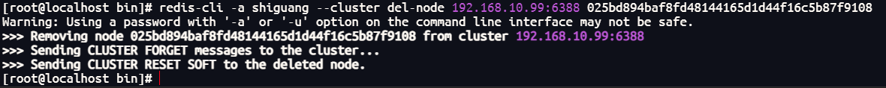

3、重新检查集群状态


可以看到6387下0 slaves，说明6388已经移除集群，集群中只剩下7个实例

4、将6387槽号清空，将槽号重新分配给6381实例

```bash
redis-cli -a shiguang --cluster reshard 192.168.10.66:6381
```


输入 `yes`


等待分配完成


5、重新检查集群状态

```bash
redis-cli -a shiguang --cluster check 192.168.10.66:6381
```


可以看到6387节点变成了6381的从节点

4096个槽位都指给6381，它变成了8192个槽位，相当于全部都给6381了，不然要输入3次，一锅端

6、将6387删除

命令：

```bash
redis-cli -a 密码 --cluster del-node ip:端口 6387节点ID
```

例如此处我使用以下命令；

 ```bash
 redis-cli -a shiguang --cluster del-node 192.168.10.99:6387 54b2de0fa7adb6c014901108af6a2335fe088da8
 ```


6、重新检查集群状态


可以看到集群又恢复到了三主三从

## 集群常用操作命令和CRC16算法分析

### 通识占位符

不在同一个slot槽位下的多键操作支持不好，不在同一个slot槽位下的键值无法使用mset、mget等多键操作


可以通过`{}`来定义同一个组的概念，使key中`{}`内相同内容的键值对放到一个slot槽位去


### CRC16源码浅谈


Redis集群有16384个哈希槽，每个key通过CRC16校验后对16384取模来决定放置哪个槽，集群的每个节点负责一部分hash槽。

### 常用命令

#### cluster-require-full-coverage

集群是否完整才对外提供服务


#### CLUSTER COUNTKEYSINSLOT slot

查看该槽号是否被占用

- 返回0，槽号尚未被占用
- 返回1，槽号已经被占用


### CLUSTER KEYSLOT key

指定键应该存放到哪个槽位上


# SpringBoot集成Redis

## 总体概述

**jedis、lettuce、RedisTemplate三者联系**

第一代：jedis

第二代：lettuce

第三代：RedisTemplate（Spring 生态体系）

## 常见问题

- bind 设置未注释
- 保护模式需设置为no
- Linux防火墙设置（关闭或配置白名单）
- Redis服务器IP地址和密码是否正确
- 忘记写Redis的服务端口和auth密码

## 集成Jedis

### Jedis介绍

Jedis Client是Redis官网推荐的一个面向java客户端，库文件实现了对各类API进行封装调用

### 步骤

1. 建Module
2. 改POM
3. 写YML
4. 主启动类
5. 业务类

### POM依赖

```xml
<?xml version="1.0" encoding="UTF-8"?>
<project xmlns="http://maven.apache.org/POM/4.0.0"
         xmlns:xsi="http://www.w3.org/2001/XMLSchema-instance"
         xsi:schemaLocation="http://maven.apache.org/POM/4.0.0 http://maven.apache.org/xsd/maven-4.0.0.xsd">
    <modelVersion>4.0.0</modelVersion>

    <groupId>com.atguigu.redis7</groupId>
    <artifactId>redis7_study</artifactId>
    <version>1.0-SNAPSHOT</version>

    <parent>
        <groupId>org.springframework.boot</groupId>
        <artifactId>spring-boot-starter-parent</artifactId>
        <version>2.6.10</version>
        <relativePath/>
    </parent>

    <properties>
        <project.build.sourceEncoding>UTF-8</project.build.sourceEncoding>
        <maven.compiler.source>1.8</maven.compiler.source>
        <maven.compiler.target>1.8</maven.compiler.target>
        <junit.version>4.12</junit.version>
        <log4j.version>1.2.17</log4j.version>
        <lombok.version>1.16.18</lombok.version>
    </properties>

    <dependencies>
        <!--SpringBoot通用依赖模块-->
        <dependency>
            <groupId>org.springframework.boot</groupId>
            <artifactId>spring-boot-starter-web</artifactId>
        </dependency>
        <!--jedis-->
        <dependency>
            <groupId>redis.clients</groupId>
            <artifactId>jedis</artifactId>
            <version>4.3.1</version>
        </dependency>
        <!--通用基础配置-->
        <dependency>
            <groupId>junit</groupId>
            <artifactId>junit</artifactId>
            <version>${junit.version}</version>
        </dependency>
        <dependency>
            <groupId>org.springframework.boot</groupId>
            <artifactId>spring-boot-starter-test</artifactId>
            <scope>test</scope>
        </dependency>
        <dependency>
            <groupId>log4j</groupId>
            <artifactId>log4j</artifactId>
            <version>${log4j.version}</version>
        </dependency>
        <dependency>
            <groupId>org.projectlombok</groupId>
            <artifactId>lombok</artifactId>
            <version>${lombok.version}</version>
            <optional>true</optional>
        </dependency>
    </dependencies>

    <build>
        <plugins>
            <plugin>
                <groupId>org.springframework.boot</groupId>
                <artifactId>spring-boot-maven-plugin</artifactId>
            </plugin>
        </plugins>
    </build>

</project>
```


### YML配置

`application.properties`

```properties
server.port=7777

spring.application.name=learn-redis
```


或者 `application.yml`

```yaml
server:
  port: 8080
spring:
  application:
    name: learn-redis
```

### 主启动类

```java
@SpringBootApplication
public class MainApplication {
    public static void main(String[] args) {
        SpringApplication.run(MainApplication.class,args);
    }
}
```

### 入门案例

```java
public class JedisDemo {
    public static void main(String[] args) {
        // 1、获取连接,通过指定ip和端口
        Jedis jedis =  new Jedis("192.168.10.66",6379);

        // 2、指定访问服务器的密码
        jedis.auth("shiguang");

        // 3、获得了jedis客户端,可以像JDBC一样访问Redis
        System.out.println(jedis.ping()); // 返回 PONG 代表连接成功


        // key2
        Set<String> keys = jedis.keys("*");
        System.out.println(keys);

        // String
        String set = jedis.set("key1", "val1");
        System.out.println(set);
        System.out.println(jedis.get("key1"));

        // list
        jedis.lpush("list", "Java", "Python", "Go");
        List<String> list = jedis.lrange("list", 0, -1);
        for (String element : list) {
            System.out.println(element);
        }


    }

}
```


## 集成Lettuce

### Lettuce介绍

Lettuce是一个Redis的Java驱动包，Lettuce翻译为生菜，没错，就是吃的那种生菜，所以它的Logo长这样


### Jedis与Lettuce的区别

Jedis和Lettuce都是Redis的客户端，它们都可以连接Redis服务器，但是<font color = 'red'>在SpringBoot2.O之后默认都是使用的Lettuce这个客户端连接Redis服务器</font>。因为当使用Jedis客户端连接Redis服务器的时候，每个线程都要拿自己创建的Jedis实例去连接Redis客户端，当有很多个线程的时候，不仅开销大需要反复的创建关闭一个Jedis连接，而且也是线程不安全的，一个线程通过Jedis实例更改Redis服务器中的数据之后会影响另一个线程；

但是如果使用Lettuce这个客户端连接Redis服务器的时候，就不会出现上面的情况，<font color = 'red'>Lettuce底层使用的是Netty</font>,
当有多个线程都需要连接Redis服务器的时候，可以保证只创建一个Lettuce连接，使所有的线程共享这一个Lettuce连接，这样可以减少创建关闭一个Lettuce连接时候的开销；而目这种方式也是线程安全的，不会出现一个线程通过Lettuce更改Redis服务器中的数据之后而影响另一个线程的情况。

### 案例

#### 改POM

```xml
<!--lettuce-->
<dependency>
    <groupId>io.lettuce</groupId>
    <artifactId>lettuce-core</artifactId>
    <version>6.2.1.RELEASE</version>
</dependency>
```

#### 业务类

> 若Slf4j使用出错需检查lombok版本

```java
@Slf4j
public class LettuceDemo {
    public static void main(String[] args) {
        // 1、使用构建器链式编程 Builder RedisURI
        RedisURI uri = RedisURI.builder()
                .redis("192.168.111.181")
                .withPort(6379)
                .withAuthentication("default", "111111")
                .build();
        // 2、创建连接客户端
        RedisClient client = RedisClient.create(uri);
        StatefulRedisConnection conn = client.connect();

        // 3、通过coond创建操作的command
        RedisCommands<String, String> commands = conn.sync();

        // TODO: 各种业务逻辑

        //keys
        List<String> list = commands.keys("*");
        for (String s : list) {
            log.info("key:{}", s);
        }
        //String
        commands.set("k1", "1111");
        String s1 = commands.get("k1");
        System.out.println("String s ===" + s1);

        //list
        commands.lpush("myList2", "v1", "v2", "v3");
        List<String> list2 = commands.lrange("myList2", 0, -1);
        for (String s : list2) {
            System.out.println("list ssss===" + s);
        }
        //set
        commands.sadd("mySet2", "v1", "v2", "v3");
        Set<String> set = commands.smembers("mySet2");
        for (String s : set) {
            System.out.println("set ssss===" + s);
        }
        //hash
        Map<String, String> map = new HashMap<>();
        map.put("k1", "138xxxxxxxx");
        map.put("k2", "atguigu");
        map.put("k3", "zzyybs@126.com");//课后有问题请给我发邮件

        commands.hmset("myHash2", map);
        Map<String, String> retMap = commands.hgetall("myHash2");
        for (String k : retMap.keySet()) {
            System.out.println("hash  k=" + k + " , v==" + retMap.get(k));
        }

        //zset
        commands.zadd("myZset2", 100.0, "s1", 110.0, "s2", 90.0, "s3");
        List<String> list3 = commands.zrange("myZset2", 0, 10);
        for (String s : list3) {
            System.out.println("zset ssss===" + s);
        }

        //sort
        SortArgs sortArgs = new SortArgs();
        sortArgs.alpha();
        sortArgs.desc();

        List<String> list4 = commands.sort("myList2", sortArgs);
        for (String s : list4) {
            System.out.println("sort ssss===" + s);
        }

        // 4、关闭和释放资源
        conn.close();
        client.shutdown();
    }
}
```

## <font color = 'red'>集成RedisTemplate（推荐）</font>

### 连接单机

#### 改POM

```xml
<!--SpringBoot与Redis整合依赖-->
<dependency>
    <groupId>org.springframework.boot</groupId>
    <artifactId>spring-boot-starter-data-redis</artifactId>
</dependency>
<dependency>
    <groupId>org.apache.commons</groupId>
    <artifactId>commons-pool2</artifactId>
</dependency>
<!--swagger2-->
<dependency>
    <groupId>io.springfox</groupId>
    <artifactId>springfox-swagger2</artifactId>
    <version>2.9.2</version>
</dependency>
<dependency>
    <groupId>io.springfox</groupId>
    <artifactId>springfox-swagger-ui</artifactId>
    <version>2.9.2</version>
</dependency>
```

#### 写YML

> 关于`documentationPluginsBootstrapper`错误详见 [Swagger 快速使用](https://gitee.com/link?target=https%3A%2F%2Fblog.shiguang666.eu.org%2F2024%2F09%2F12%2F85b8e5222f2d%2F)

`application.properties`

```properties
server.port=7777

spring.application.name=redis7_study

# ========================logging=====================
logging.level.root=info
logging.level.com.atguigu.redis7=info
logging.pattern.console=%d{yyyy-MM-dd HH:mm:ss.SSS} [%thread] %-5level %logger- %msg%n 

logging.file.name=D:/mylogs2023/redis7_study.log
logging.pattern.file=%d{yyyy-MM-dd HH:mm:ss.SSS} [%thread] %-5level %logger- %msg%n

# ========================swagger=====================
spring.swagger2.enabled=true
#在springboot2.6.X结合swagger2.9.X会提示documentationPluginsBootstrapper空指针异常，
#原因是在springboot2.6.X中将SpringMVC默认路径匹配策略从AntPathMatcher更改为PathPatternParser，
# 导致出错，解决办法是matching-strategy切换回之前ant_path_matcher
spring.mvc.pathmatch.matching-strategy=ant_path_matcher

# ========================redis单机=====================
spring.redis.database=0
# 修改为自己真实IP
spring.redis.host=192.168.111.185
spring.redis.port=6379
spring.redis.password=111111
spring.redis.lettuce.pool.max-active=8
spring.redis.lettuce.pool.max-wait=-1ms
spring.redis.lettuce.pool.max-idle=8
spring.redis.lettuce.pool.min-idle=0
```

或者 `application.yml`

```yaml
server:
  port: 8080
spring:
  application:
    name: learn-redis
############################### 自定义Swigger配置 ###############################
  #在springboot2.6.X结合swagger2.9.X会提示documentationPluginsBootstrapper空指针异常，
  #原因是在springboot2.6.X中将SpringMVC默认路径匹配策略从AntPathMatcher更改为PathPatternParser，
  # 导致出错，解决办法是matching-strategy切换回之前ant_path_matcher
  mvc:
    pathmatch:
      matching-strategy: ant_path_matcher
  swigger2:
    enabled: true


###############################  Redis 单机 ###############################
  redis:
    database: 0
    host: 192.168.10.66
    port: 6379
    password: shiguang
    lettuce:
      pool:
        max-active: 8
        max-wait: -1ms
        max-idle: 8
        min-idle: 0


###############################  logging ###############################
logging:
  level:
    root: info
    com.shiguang: info
  pattern:
    console: "%d{yyyy-MM-dd HH:mm:ss.SSS} [%thread] %-5level %logger- %msg%n"
    file: "%d{yyyy-MM-dd HH:mm:ss.SSS} [%thread] %-5level %logger- %msg%n"
  file:
    name: D:/Files/redis7/redis.log
```


#### `SwaggerConfig`

```java
@Configuration
@EnableSwagger2
public class SwaggerConfig
{
    @Value("${spring.swigger2.enabled}")
    private Boolean enabled;

    @Bean
    public Docket createRestApi() {
        return new Docket(DocumentationType.SWAGGER_2)
                .apiInfo(apiInfo())
                .enable(enabled)
                .select()
                .apis(RequestHandlerSelectors.basePackage("com.shiguang")) //你自己的package
                .paths(PathSelectors.any())
                .build();
    }
    public ApiInfo apiInfo() {
        return new ApiInfoBuilder()
                .title("springboot利用swagger2构建api接口文档 "+"\t"+ DateTimeFormatter.ofPattern("yyyy-MM-dd").format(LocalDateTime.now()))
                .description("springboot+redis整合")
                .version("1.0")
                .termsOfServiceUrl("https://blog.shiguang666.eu.org/")
                .build();
    }
}
```

#### controller

```java
@RestController
@Slf4j
@Api(tags = "订单接口")
@RequestMapping("order")
public class OrderController {

    @Resource
    private OrderService orderService;

    @ApiOperation("新增订单")
    @PostMapping()
    public void addOrder(){
        orderService.addOrder();
    }

    @ApiOperation("根据keyId 查询订单")
    @GetMapping("{id}")
    public void getOrderById(@PathVariable() Integer id){
        orderService.getOrderById(id);
    }
}
```


#### service

```java
@Slf4j
@Service
public class OrderService {
    public static final String ORDER_KEY = "order:";

    @Resource
    private RedisTemplate redisTemplate;

    public void addOrder() {
        int keyId = ThreadLocalRandom.current().nextInt(1000) + 1;
        String orderNo = UUID.randomUUID().toString();
        String key = ORDER_KEY + keyId;
        String value = "京东订单" + orderNo;
        redisTemplate.opsForValue().set(key, value);
        log.info("key:{}",key);
        log.info("value:{}",value);
    }

    public String getOrderById(Integer id) {
        return (String) redisTemplate.opsForValue().get(ORDER_KEY + id);
    }
}
```


#### 序列号问题

键(key)和值(value)都是通过Spring提供的SerializerF序列化到数据库的。
`RedisTemplate`默认使用的是`JdkSerializationRedisSerializer`。KEY被序列化成这样，线上通过KEY去查询对应的VALUE非常不方便。


使用`redis-cli`连接解决乱码问题可以在登录时使用`--raw`命令


JDK 序列化方式 （默认）

`org.springframework.data.redis.serializer.JdkSerializationRedisSerializer` ，

默认情况下，`RedisTemplate` 使用该数据列化方式，我们来看下源码 `afterPropertiesSet()`方法


**解决方案**

1、使用 `RedisTemplate`的子类`StringRedisTemplate`，默认使用的是`StringRedisSerializer`

2、添加配置类实现和 `StringRedisTemplate`相同功能

```java
@Configuration
public class RedisConfig
{
    /**
     * redis序列化的工具配置类，下面这个请一定开启配置
     * 127.0.0.1:6379> keys *
     * 1) "ord:102"  序列化过
     * 2) "\xac\xed\x00\x05t\x00\aord:102"   野生，没有序列化过
     * this.redisTemplate.opsForValue(); //提供了操作string类型的所有方法
     * this.redisTemplate.opsForList(); // 提供了操作list类型的所有方法
     * this.redisTemplate.opsForSet(); //提供了操作set的所有方法
     * this.redisTemplate.opsForHash(); //提供了操作hash表的所有方法
     * this.redisTemplate.opsForZSet(); //提供了操作zset的所有方法
     * @param lettuceConnectionFactory
     * @return
     */
    @Bean
    public RedisTemplate<String, Object> redisTemplate(LettuceConnectionFactory lettuceConnectionFactory)
    {
        RedisTemplate<String,Object> redisTemplate = new RedisTemplate<>();

        redisTemplate.setConnectionFactory(lettuceConnectionFactory);
        //设置key序列化方式string
        redisTemplate.setKeySerializer(new StringRedisSerializer());
        //设置value的序列化方式json，使用GenericJackson2JsonRedisSerializer替换默认序列化
        redisTemplate.setValueSerializer(new GenericJackson2JsonRedisSerializer());

        redisTemplate.setHashKeySerializer(new StringRedisSerializer());
        redisTemplate.setHashValueSerializer(new GenericJackson2JsonRedisSerializer());

        redisTemplate.afterPropertiesSet();

        return redisTemplate;
    }
}
```


### 连接集群

#### 改YML

`application.properties`

```properties
# ========================redis集群=====================
spring.redis.password=111111
# 获取失败 最大重定向次数
spring.redis.cluster.max-redirects=3
spring.redis.lettuce.pool.max-active=8
spring.redis.lettuce.pool.max-wait=-1ms
spring.redis.lettuce.pool.max-idle=8
spring.redis.lettuce.pool.min-idle=0
spring.redis.cluster.nodes=192.168.111.175:6381,192.168.111.175:6382,192.168.111.172:6383,192.168.111.172:6384,192.168.111.174:6385,192.168.111.174:6386
```

或者 `application.yml`

```yml
spring:  
  redis:
    database: 0
    host: 192.168.10.66
    port: 6379
    password: shiguang
    lettuce:
      pool:
        max-active: 8
        max-wait: -1ms
        max-idle: 8
        min-idle: 0
    ## 集群
    cluster:
      nodes: "192.168.10.66:6381,192.168.10.66:6382,192.168.10.88:6383,192.168.10.88:6384,192.168.10.99:6385,192.168.10.99:6386"
      # 最大重定向次数
      max-redirects: 3
```

#### 问题

**故障演练：**

人为模拟，master-6381机器意外宕机，手动shutdown，先对redis集群命令方式，手动验证各种读写命令，看看6384是否上位，Redis Cluster集群能自动感知并自动完成主备切换，对应的slaver 6384会被选举为新的master节点

**故障现象**：

<font color = 'red'>SpringBoot客户端没有动态感知到RedisCluster的最新集群信息</font>

Redis Cluster集群部署采用了3主3从拓扑结构，数据读写访问master节点， slave节点负责备份。当master宕机主从切换成功，redis手动OK，but 2个经典故障


**原因分析：**

SpringBoot2,X版本，Redis默认的连接池采用Lettuce，当Redis集群节点发生变化后，Letture默认是不会刷新节点拓扑

**解决方案：**

1、排除lettuce采用jedis<font color = 'red'>（不推荐）</font>


2、重写连接工厂实例<font color = 'red'>（极度不推荐）</font>

```java
//仅做参考，不写，不写，不写。


@Bean

public DefaultClientResources lettuceClientResources() {

    return DefaultClientResources.create();

}

 

@Bean

public LettuceConnectionFactory lettuceConnectionFactory(RedisProperties redisProperties, ClientResources clientResources) {

 

    ClusterTopologyRefreshOptions topologyRefreshOptions = ClusterTopologyRefreshOptions.builder()

            .enablePeriodicRefresh(Duration.ofSeconds(30)) //按照周期刷新拓扑

            .enableAllAdaptiveRefreshTriggers() //根据事件刷新拓扑

            .build();

 

    ClusterClientOptions clusterClientOptions = ClusterClientOptions.builder()

            //redis命令超时时间,超时后才会使用新的拓扑信息重新建立连接

            .timeoutOptions(TimeoutOptions.enabled(Duration.ofSeconds(10)))

            .topologyRefreshOptions(topologyRefreshOptions)

            .build();

 

    LettuceClientConfiguration clientConfiguration = LettuceClientConfiguration.builder()

            .clientResources(clientResources)

            .clientOptions(clusterClientOptions)

            .build();

 

    RedisClusterConfiguration clusterConfig = new RedisClusterConfiguration(redisProperties.getCluster().getNodes());

    clusterConfig.setMaxRedirects(redisProperties.getCluster().getMaxRedirects());

    clusterConfig.setPassword(RedisPassword.of(redisProperties.getPassword()));

 

    LettuceConnectionFactory lettuceConnectionFactory = new LettuceConnectionFactory(clusterConfig, clientConfiguration);

 

    return lettuceConnectionFactory;

}
```

3、刷新节点集群拓扑动态感应<font color = 'green'>（推荐）</font>

> https://github.com/lettuce-io/lettuce-core/wiki/Redis-Cluster#user-content-refreshing-the-cluster-topology-view


改写配置文件配置自适应拓扑刷新及定时刷新时间即可

`application.properties`

```properties
# ========================redis集群=====================
spring.redis.password=111111
# 获取失败 最大重定向次数
spring.redis.cluster.max-redirects=3
spring.redis.lettuce.pool.max-active=8
spring.redis.lettuce.pool.max-wait=-1ms
spring.redis.lettuce.pool.max-idle=8
spring.redis.lettuce.pool.min-idle=0
#支持集群拓扑动态感应刷新,自适应拓扑刷新是否使用所有可用的更新，默认false关闭
spring.redis.lettuce.cluster.refresh.adaptive=true
#定时刷新
spring.redis.lettuce.cluster.refresh.period=2000
spring.redis.cluster.nodes=192.168.111.175:6381,192.168.111.175:6382,192.168.111.172:6383,192.168.111.172:6384,192.168.111.174:6385,192.168.111.174:6386
```

或者

`application.yml`

```yaml
###############################  Redis 配置  ###############################
  redis:
    database: 0
    host: 192.168.10.66
    port: 6379
    password: shiguang
    lettuce:
      pool:
        max-active: 8
        max-wait: -1ms
        max-idle: 8
        min-idle: 0
    ###### Redis集群配置
      cluster:
        refresh:
          ## 支持集群拓扑动态感应刷新,自适应拓扑刷新是否使用所有可用的更新，默认false关闭
          adaptive: true
          ## 定时刷新
          period: 2000
    cluster:
      nodes: "192.168.10.66:6381,192.168.10.66:6382,192.168.10.66:6383,192.168.10.66:6384,192.168.10.66:6385,192.168.10.66:6386"
```


**参考**

> [菜鸟教程](https://www.runoob.com/redis/redis-tutorial.html)


